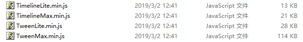
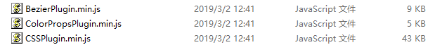

# 动画

# GSAP(GreenSock 动画平台)

# 介绍

**GSAP**最初在flash时代（2004-2006）是作为flash软件的插件用来增添动画效果，当时的名字是「GreenSock Tweening Platform」（GreenSock补间平台）。后来Flash逐渐没落，在网页上的应用，除了游戏和视频播放之外不断减少。
在网页上**GreenSock**目前提供使用的有`「TweenLite」`、`「TweenMax」`、`「TimelineLite」`、`「TimelineMax」`这四个项目，虽比Flash来的少，不过也是最常用的几项，相信可以帮助设计师们在不使用Flash的情形之下，制作许多不同凡响的动画效果。
**GreenSock** 的优势在于性能强劲和功能强大，由于把功能分成了各个插件，而从使得文件相对较小。

[GSAP官方地址](https://www.tweenmax.com.cn/)   :arrow_left: 点它

---

# 补间动画

在介绍**GSAP**项目之前，我们需要了解`补间动画`是什么。

`补间动画` ：补间动画指的是做FLASH动画时，在两个关键帧中间需要做“补间动画”，才能实现图画的运动。简单来说就是你给定一个`起始帧`和一个`结束帧`，中间的`插补帧`由计算机来运算实现。    
举个栗子 :hand: ：想让一个元素从起始帧 `{x : 0, y : 0}`  的位置移动到结束帧 `{x : 100, y : 100}` 的位置，我们只需要将元素的起点位置和结束位置定义好，计算机会自动补全中间过程，这种便叫做补间动画。

---

# 补间动画库

市面上有不少优秀的补间动画库，**GSAP** 、**tween.JS** 、**anime.JS** ......，而 **GSAP** 是使用最为广泛的动画库，凭啥？ :call_me_hand:

1.  **速度快**：GSAP专门优化了动画性能，使之实现和CSS一样的高性能动画效果。
2.  **轻量与模块化**：模块化与插件式的结构保持了核心引擎的轻量，TweenLite包非常小（基本上低于7kb）。**GSAP**提供了`TweenLite`, `TimelineLite`, `TimelineMax` 和 `TweenMax`不同功能的动画模块，你可以按需使用。
3.  **没有依赖**：也是就说不需要依赖`jquery`等第三方库就能实现。
4.  **灵活控制**：不用受限于线性序列，可以重叠动画序列，你可以通过精确时间控制，灵活地使用最少的代码实现动画。
5.  **兼容性好**：核心功能兼容**各种新旧浏览器、移动设备**等，**IE6**这个爸爸都表示我可以。并且**GSAP**的`CSSPlugin` 可以灵活的处理一些新CSS3属性，如`3D Transforms`，`boxShadow`，`textShadow`，`borderRadius`和`clip`。此外，你无需担心一连串的浏览器引擎前缀。
6.  **新新新**：重要的事情说三遍，论坛可以看到比较新的技术贴，看看大佬们的案例。百度上能搜到的内容也多，并且中文API文档很详细很易懂啊，对于英语不好的人来说简直就是福利。

----

# GSAP各项目区别

上面我们有说到，**GSAP**有四个项目：`「TweenLite」`、`「TweenMax」`、`「TimelineLite」`、`「TimelineMax」`，那么它们之间又有什么区别？

1. **TweenMax**：用来构建补间动画(tween)。它是GSAP的一个特殊文件，为了使用简便，它把常用的插件整合到了一起。就是说你只要加载了`TweenMax.js`，就可以使用核心工具、`CSSPlugin`、`BezierPlugin`、高级时间曲线等，`TweenLite`和`TimelineLite`等都包含在`TweenMax.min.js`中，可以说是一劳永逸的方法了，但是缺点是文件相对`TweenLite`来说大一些，114KB。
2. **TweenLite**：它是简约版的`TweenMax`，也就是说和`TweenMax`基础功能是一样的，但是体积小，28KB。相应的，功能比`TweenMax`少，如果要使用核心工具，如`CSSPlugin`、`BezierPlugin`、高级时间曲线等，就需要再额外加载这些插件，也就是说，你可以根据自己的需求去选择插件来减少文件体积。
3. **TimelineMax**：它是GreenSock 动画平台中的动画组织、排序、管理工具，可创建时间轴（timeline）作为动画或其他时间轴的容器，这使得整个动画控制和精确管理时间变得简单。相比`TweenMax`更常用，缺点是相比`TimelineLite`体积大，并且如果要使用到核心工具，如`CSSPlugin`、`BezierPlugin`、高级时间曲线等，也是需要加载相应的插件才能实现功能。优点就是相对`TimelineLite`来讲功能会多点。
4. **TimeLineLite**：和`TimelineMax`基础功能一样，只是少了些`TimelineMax`的独有方法，因此体积小些。

说了这么多，到底用哪一个呢？
从我个人的感受上来说，直接使用`TweenMax.min.js`来开发更省事，但是如果追求那么几十kb的流量差别，那就乖乖的用其他三个，然而既然是做动画，那么`CSSPlugin`插件肯定少不了，但是这个插件体积也有43KB，:joy:你们自己想吧，狗头保命.jpg。

贴图为证：

**注意**：**GSAP**的项目API介绍我放在了同级的子目录下，劳烦各位动动小手自己点进去看了。

