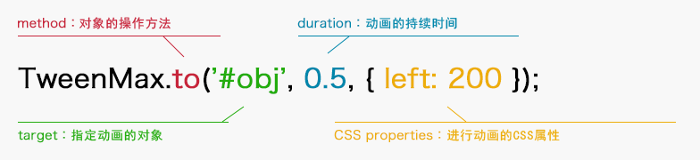
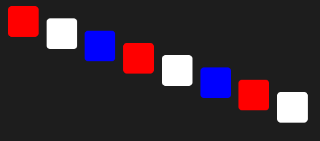

# TweenMax

[官方文档](https://www.tweenmax.com.cn/api/tweenmax/)  :arrow_left:点它​


# 兼容性

- TweenMax的核心功能兼容**各种新旧浏览器、移动设备**等。


1. TweenMax 可以在现代浏览器中实现各种3D Transforms（缩放，倾斜，旋转，x和y轴运动），其2D动画甚至兼容IE6。

2. 使用TweenMax 不需要添加笨重的浏览器前缀和hack。

3. 自动解决SVG在各种浏览器的渲染问题。

   :+1:  

- TweenMax 中 3D Transforms 和其他CSS3 属性动画的兼容性

  **GSAP**的`CSSPlugin` 可以灵活的处理一些新CSS3属性，如3D Transforms，boxShadow，textShadow，borderRadius和clip。并且，你无需担心一连串的浏览器引擎前缀。

| 属性          | 兼容                                                         |
| ------------- | ------------------------------------------------------------ |
| 3D Transforms | Chrome 12, Safari 4, Firefox 10, IE 10, iOS 3.2, Android 3.0<br />1. 浏览器之间的性能差别很大。一般来说，像Chrome和Safari这样的Webkit浏览器做得最好。 <br />2. 在某些浏览器中，当元素开始/结束3D动画时，您可能会注意到像素的轻微移位。已知的解决方法是添加`transform:translateZ(0.1px);` <br />3. 当屏幕上有3D元素时，字体抗锯齿可能会发生变化。在Webkit浏览器中，您可以通过在CSS中设置`-webkit-font-smoothing:antialiased`来解决此问题。 <br />4. 如果浏览器不支持3D转换，则只会忽略它们（不会生成错误）。 <br />5. IE10支持3D转换，但它并不支持`preserve-3d` |
| textShadow    | Chrome 22, Safari 5.1, Firefox 15, IE 10, Opera 12.1, iOS 3.2, Android 2.1 |
| boxShadow     | Chrome 22, Safari 5.1, Firefox 15, IE 9, Opera 12.1, iOS 3.2, Android 2.1 |
| borderRadius  | Chrome 22, Safari 5.1, Firefox 15, IE 9, Opera 12.1, iOS 3.2, Android 2.1) |
| clip          | Chrome 2, Safari 1.3, Firefox 1, IE 9, Opera 9.2, iOS 3.2, Android 2.1 |

---


# 使用方法

## NPM引入

1. 安装

   ```npm
   npm install gsap --save-dev    //npm安装GSAP包
   ```

2. 导入

   ```npm
   import {TweenMax} from ‘gsap’    //当然也可以引入TweenLite
   ```

3. 使用

   ```js
   TweenMax.to('#test', 0.5, { x : 100 })
   ```

   

## CDN及文件引用方式

1. 获取TweenMax的JS包

   有两种方式

   - [下载](https://www.tweenmax.com.cn/source/) 免费JS包

   - CDN

     请将x.x.x改成你需要的版本号，例如2.0.1

     ````html
     <!-- TweenMax.js CDN -->
     <script src="https://cdnjs.cloudflare.com/ajax/libs/gsap/x.x.x/TweenMax.min.js"> </script>
     
     <!-- TweenLite和其他组件 CDN -->
     <script src="https://cdnjs.cloudflare.com/ajax/libs/gsap/x.x.x/TweenLite.min.js"> </script>
     <script src="https://cdnjs.cloudflare.com/ajax/libs/gsap/x.x.x/plugins/CSSPlugin.min.js"> </script>
     <script src="https://cdnjs.cloudflare.com/ajax/libs/gsap/x.x.x/easing/EasePack.min.js"> </script>
     ````

     

2. 加载JS文件

   必须要加载核心工具`TweenLite.min.js`或者`TweenMax.min.js`。此外还需要加载其他需要的插件，例如基础插件，时间轴，拓展时间曲线，商业插件等。

   建议在开发中加载`TweenMax.min.js`这个全功能的JS文件，因为它包括了GreenSock动画平台的大部分核心功能。如果是加载`TweenLite.min.js` 我们则需要再加载其他的插件。

   - 如果加载的是`TweenLite.min.js`

     ````html
     <!-- 核心工具，可初始化TweenLite对象 -->
     <script src="js/greensock-js/TweenLite.min.js"> </script>  
     
     <!-- 基础插件，用于制作CSS动画2D，3D动画 -->
     <script src="js/greensock-js/plugins/CSSPlugin.min.js"> </script>
     
     <!-- 基础插件，用于制作贝塞尔曲线 -->
     <script src="js/greensock-js/plugins/BezierPlugin.min.js"> </script>
     
     <!-- 核心工具，创建时间轴管理动画 -->
     <script src="js/greensock-js/TimelineLite.min.js"> </script>
     
     <!-- 拓展的时间曲线，例如bounce -->
     <script src="js/greensock-js/easing/EasePack.min.js"> </script>
     ````

   - 如果加载的是`TweenMax.min.js` ，则以上的加载可以简约为

     ````html
     <script src="js/greensock-js/TweenMax.min.js"> </script>
     ````

     哪个方便，一:eye:了然

     

3. 开始制作动画

   开始之前，我们需要了解一下动画三要素：

   1.  动画目标对象  :man:

   2.  动画的持续时间  :hourglass:
   3.  变化的属性  :collision:

   

   举个栗子 :chestnut::

   使用TweenMax的`to()`方法，将一个id为"obj"的DOM元素的CSS属性的left属性从当前值过渡到500px，从而产生移动效果。持续时间3秒。


   HTML

   ```HTml
   <div id="obj"></div>
   ```

   JS

   ```js
   TweenMax.to("#obj", 3, {left:500});
   ```

   

   ***注意***： left属性动画需要position:reletive支持，如需相对位置移动可使用{x : 500 }(CSS3的2D动画)更为简便

   JS

   ```js
   TweenMax.to("#obj", 3, {x:200});        //在原有位置向右移动200px
   TweenMax.to("#obj", 3, {x:200, y:100}); //向右移动200px的同时向下移动100px
   ```

----


# TweenMax.JS API

以下内容都是基于`TweenMax.min.js` 


# 动画结构

## TweenMax()

```js
.TweenMax( target:Object, duration:Number, vars:Object ) ;
```

TweenMax的构造函数，用来构建一个TweenMax对象。

**参数**

| 参数名   | 类型   | 是否必填 | 描述                   |
| -------- | ------ | -------- | ---------------------- |
| target   | object | 是       | 需要缓动的对象         |
| duration | number | 是       | 动画持续时间，一般是秒 |
| vars     | object | 是       | 动画参数               |

**示例**

html

```html
<div class="box"></div>
```

js

````js
new TweenMax('.box', 3, {
    x: 500,
    alpha : 0.3,
});
````

将元素从当前位置向x方向移动500px并且透明度变成0.3，持续时间为3秒

----


## TweenMax.to()

```js
TweenMax.to( target:Object, duration:Number, vars:Object )
```

此方法用于创建一个从当前属性到指定目标属性的TweenMax动画对象。

以下几种方式效果相同

````js
TweenMax.to(obj, 1, {x:100});
var myTween = new TweenMax(obj, 1, {x:100})
var myTween = TweenMax.to(obj, 1, {x:100});
````

当然，我们也可以同时对多个对象进行动画

```js
TweenMax.to([obj1, obj2, obj3], 1, {x:100});
```

**参数**

| 参数名   | 类型   | 是否必填 | 描述                                  |
| -------- | ------ | -------- | ------------------------------------- |
| target   | object | 是       | 需要动画的对象                        |
| duration | number | 是       | 动画持续时间，一般是秒                |
| vars     | object | 是       | 动画参数（CSS属性、延迟、重复次数等） |

**示例**

html

````ht
<div class="wrapper">
  <div class="box green"></div>
  <div class="box orange"></div>
  <div class="box grey"></div>
</div>
````

js

````js
var myTween = TweenMax.to(".box", 1, {
  x: function(index, target) {
    console.log(index, target);
    return (index + 1) * 100 // 100, 200, 300
  }
})
````

可以通过function关键词返回变化值，函数中的参数为index(索引值) ，target(目标)

以上例子对三个元素进行动画，分别向X轴方向运动100px、200px、300px

---


## TweenMax.from()

```js
TweenMax.from( target:Object, duration:Number, vars:Object )
```

通过设置动画起始点来初始化一个TweenMax，相当于动画从设置点开始。

```js
TweenMax.from(mc, 1.5, {opacity:0, delay:2});   //delay 延迟2s执行
```

多个目标的动画

```js
TweenMax.from([mc1, mc2, mc3], 1.5, {opacity:0});
```


**参数**

| 参数名   | 类型   | 是否必填 | 描述                         |
| -------- | ------ | -------- | ---------------------------- |
| target   | object | 是       | 需要动画的对象               |
| duration | number | 是       | 动画持续时间，一般是秒       |
| vars     | object | 是       | 设置动画的一些属性及其他参数 |

**示例**

html

```html
<div class="box green"></div>
```

js

````js
var myTween = TweenMax.from(".box", 3, {
  x: 500,
})
````

元素从500px开始，返回原来位置

---


## TweenMax.fromTo()

````js
TweenMax.fromTo( target:Object, duration:Number, fromVars:Object, toVars:Object )
````

通过设置动画起始点和结束点来初始化一个TweenMax，相当于动画从设置点到第二个设置点。

```js
TweenMax.fromTo(element, 1, {x:200}, {x:500});
```

**参数**

| 参数名   | 类型   | 是否必填 | 描述                   |
| -------- | ------ | -------- | ---------------------- |
| target   | object | 是       | 需要动画的对象         |
| duration | number | 是       | 动画持续时间，一般是秒 |
| fromVars | object | 是       | 起始点动画参数         |
| toVars   | object | 是       | 结束点动画参数         |

html

````html
<div class="box green"></div>
````

js

````js
var myTween=TweenMax.fromTo('.box', 3, {x: 200,},{x: 500,});
//从200到500
````

例子中的元素从200px移动到500px

---


## TweenMax.staggerTo()

```js
TweenMax.staggerTo( targets:Array, duration:Number, vars:Object, stagger:Number, onCompleteAll:Function, onCompleteAllParams:Array, onCompleteAllScope:* )
```

stagger系列方法为多个目标制作一个有间隔的动画序列，相当于有多个TweenMax的数组。
需要设置每个动画的开始间隔。如不设置则为零，同时开始动画。

```js
// 定义一个对象数组
var objects = [obj1, obj2, obj3, obj4, obj5];
TweenMax.staggerTo(objects, 1, {y:150, opacity:0}, 0.2);
```

**参数**

| 参数名              | 类型     | 是否必填 | 描述                                               |
| ------------------- | -------- | -------- | -------------------------------------------------- |
| targets             | Array    | 是       | 要进行动画的对象，可以有多个，以数组形式传入       |
| duration            | number   | 是       | 动画持续的秒数（或帧数，如果设置了useFrames:true） |
| vars                | object   | 是       | 设置动画的一些属性及其他参数                       |
| stagger             | Number   | 否       | 每个动画的起始间隔，默认是0                        |
| onCompleteAll       | Function | 否       | 当所有显示对象都完成动画后要调用的函数             |
| onCompleteAllParams | Array    | 否       | onCompleteAll函数的参数，以数组形式传入            |
| onCompleteAllScope  |          | 否       | onCompleteAll函数的作用域，this                    |

**示例**

html

```html
  <h2>TweenMax.staggerTo()</h2>
  <div id="demo">
    <p>每个动画序列的开始时间间隔0.5秒</p>
    <div class="box green"></div>
    <div class="box grey"></div>
    <div class="box orange"></div>
    <div class="box green"></div>
    <div class="box grey"></div>
    <div class="box orange"></div>
    <div class="box green"></div>
    <div class="box grey"></div>
    <div class="box orange"></div>
  </div>
```

js

```js
TweenMax.staggerTo(".box", 1, {rotation:360, y:100}, 0.5);
```

例子将所有元素间隔0.5秒相继执行动画，旋转360度，向Y轴移动100px

---


## TweenMax.staggerFrom()

````js
TweenMax.staggerFrom( targets:Array, duration:Number, vars:Object, stagger:Number, onCompleteAll:Function, onCompleteAllParams:Array, onCompleteAllScope:* )
````

通过设定序列动画的终点来初始化一组TweenMax。

```js
// 创建一个对象数组
var objects = [obj1, obj2, obj3, obj4, obj5];
TweenMax.staggerFrom(objects, 1, {y:"+=150"}, 0.2);
```

**参数**

| 参数名              | 类型     | 是否必填 | 描述                                               |
| ------------------- | -------- | -------- | -------------------------------------------------- |
| targets             | Array    | 是       | 要进行动画的对象，可以有多个，以数组形式传入       |
| duration            | number   | 是       | 动画持续的秒数（或帧数，如果设置了useFrames:true） |
| vars                | object   | 是       | 设置动画的一些属性及其他参数                       |
| stagger             | Number   | 否       | 每个动画的间隔，默认是0                            |
| onCompleteAll       | Function | 否       | 当所有显示对象都完成动画后要调用的函数             |
| onCompleteAllParams | Array    | 否       | 传递给onCompleteAll函数的参数，以数组形式传入      |
| onCompleteAllScope  |          | 否       | onCompleteAll函数的作用域                          |

**示例**

html

````html
  <div class="box"></div>
  <div class="box"></div>
  <div class="box"></div>
  <div class="box"></div>
  <div class="box"></div>
  <div class="box"></div>
  <div class="box"></div>
  <div class="box"></div>
````

js

```js
TweenMax.staggerFrom(".box", 1, {
   y:function(index){
     return index * 20;   // 0，20，40，60，80，100，120，140
  }
}, 0.5);
```

例子中将所有.box元素间隔0.5s从指定的位置移动到初始位置，每个动画持续1s。

---


## TweenMax.staggerFromTo()

```js
TweenMax.staggerFromTo( targets:Array, duration:Number, fromVars:Object, toVars:Object, stagger:Number, onCompleteAll:Function, onCompleteAllParams:Array, onCompleteAllScope:* )
```

通过设定序列动画的起点和终点来初始化一个TweenMax。

```js
// 创建一个对象数组
var objects = [obj1, obj2, obj3, obj4, obj5];
TweenMax.staggerFromTo(objects, 1, {opacity:1}, {opacity:0}, 0.2);
```

**参数**

| 参数名              | 类型     | 是否必填 | 描述                                               |
| ------------------- | -------- | -------- | -------------------------------------------------- |
| targets             | Array    | 是       | 要进行动画的对象，可以有多个，以数组形式传入       |
| duration            | number   | 是       | 动画持续的秒数（或帧数，如果设置了useFrames:true） |
| fromVars            | object   | 是       | 设置动画的一些属性及其他参数                       |
| toVars              | object   | 是       | 设置动画的一些属性及其他参数                       |
| stagger             | Number   | 否       | 每个动画的间隔，默认是0                            |
| onCompleteAll       | Function | 否       | 当所有显示对象都完成动画后要调用的函数             |
| onCompleteAllParams | Array    | 否       | 传递给onCompleteAll函数的参数，以数组形式传入      |
| onCompleteAllScope  |          | 否       | onCompleteAll函数的作用域                          |

**示例**

html

```html
  <div class="box"></div>
  <div class="box"></div>
  <div class="box"></div>
  <div class="box"></div>
  <div class="box"></div>
  <div class="box"></div>
  <div class="box"></div>
  <div class="box"></div>
```

js

```js
TweenMax.staggerFromTo(".box", 1, {
    // 起始点也就是fromVars
   y:function(index){
     return index * 10;
   }
},
 {
    // 终点也就是toVars
   y:function(){
     return (Math.random() * 100) + 20;
   }
}, 0.5);
```

---


## TweenMax.delayedCall()

```js
TweenMax.delayedCall( delay:Number, callback:Function, params:Array, scope:*, useFrames:Boolean )
```

提供一种在设定的时间（或帧）后调用函数的简单方法。

```js
//1秒后执行myFunction并传递两个参数:
TweenMax.delayedCall(1, myFunction, ["param1 value", "param2 value"]);
function myFunction(param1, param2) {
    console.log(param1+param2+this)
}
```

**参数**

| 参数名    | 类型     | 是否必填 | 描述                                                 |
| --------- | -------- | -------- | ---------------------------------------------------- |
| delay     | Number   | 是       | 要延迟的秒数（或帧数，如果设置了useFrames:true）     |
| callback  | Function | 是       | 要延迟执行的函数                                     |
| params    | Array    | 否       | 传递给onComplete函数的参数，以数组形式传入           |
| scope     | *        | 否       | 函数的作用域，this的指向，默认为空                   |
| useFrames | Boolean  | 否       | 设定延迟的时间模式是基于秒数还是帧数 ，默认false：秒 |

**示例**

html

```html
<div class="box green"></div>
```

js

```js
var myTween=new TweenMax('.box', 3, {
    x: 500,
})
var myTween2=TweenMax.delayedCall(2,myFunction,["参数1","参数2"])
function myFunction(param1, param2) {
   alert("延迟2秒输出"+param1+'和'+param2);
}
```

例子定义了一个持续3s的动画，2s后调用函数`myFunction`，并且函数传入了两个参数。

---


## TweenMax.set()

```js
TweenMax.set( target:Object, vars:Object )
```

立即设置目标的属性值而不产生过渡动画，相当于0的动画时间。可以用来设置一些元素的默认动画属性。

```js
//以下两个设置作用相同
TweenMax.set(myObject, {x:100});
TweenMax.to(myObject, 0, {x:100});
```

**参数**

| 参数名 | 类型   | 是否必填 | 描述           |
| ------ | ------ | -------- | -------------- |
| target | object | 是       | 需要移动的对象 |
| vars   | object | 是       | 动画参数       |

**示例**

html

```html
<div class="wrapper">
	<div class="box"></div>
	<div class="nbox box"></div>
</div>
```

js

```js
TweenMax.set(".nbox",{transformPerspective:300});
//或者设置父级元素，使其全部子元素产生3D效果 TweenMax.set(".wrapper",{perspective:200});
TweenMax.to(".box", 3, {rotationY:360, transformOrigin:"left top"})
```

也可以为一个数组设置属性

```js
TweenMax.set([obj1, obj2, obj3], {x:100, y:50, opacity:0});
```


例子中用TweenMax.set设置了`.nbox`的属性值`transformPerspective`，定义 3D 元素距视图的距离，然后对.box元素都使用了TweenMax.to设置3s动画，旋转360度，中心设为左上。如图，右边的设置了`transformPerspective`，看起来更有3D效果。

---


# 动画初始设置(动画属性)

## delay(延迟)

```js
delay:Number
```

动画开始之前的延迟秒数（以帧为单位时则为帧数）。

**示例**

html

```html
<div class="box green"></div>
```

js

```js
new TweenMax('.box', 3, {
    x: 500,
    delay: 3    // 动画延迟3s执行
});
```

例子中`delay`属性设置了动画延迟3s执行

---


## ease(速度曲线)

```js
ease: Ease (or Function or String)
```

过渡效果的速度曲线（缓动效果）。你可以在动画的参数中设置各种缓动来控制动画的变化率，赋予其特定的“感觉”。

| JS文件    | ease缓动类型                                                 | 参数                          |
| --------- | ------------------------------------------------------------ | ----------------------------- |
| TweenLite | Power0、Power1、Power2、Power3、Power4、Linear、Quad、Cubic、Quart、Quint、Strong | .easeIn、.easeOut、.easeInOut |
| TweenMax  | Power0、Power1、Power2、Power3、Power4、Linear、Quad、Cubic、Quart、Quint、Strong、Elastic、Back、Bounce、SlowMo、SteppedEase、RoughEase、Circ、Expo、Sine | .easeIn、.easeOut、.easeInOut |

通过`ease`缓动类型 . 参数的形式来设置`ease`属性。

此外，缓动效果还可以像`Jquery`那样写，`easeOutStrong` 等同于`Strong.easeOut` 。

**示例**

html

```html
<div class="box green"></div>
```

js

```js
new TweenMax('.box', 3, {
    x: 500,
    ease: Bounce.easeOut
});
```

---


## paused(暂停)

````js
paused: Boolean
````

如果设置为true，动画将在创建时立即暂停，默认false。

**示例**

html

```html
<div class="box green"></div>
<br>
<input type="button" id="playBtn" value="play()" title="播放">
```

js

```js
tween = new TweenMax('.box', 3, {
    x: 500,
    paused: true   // 动画创建时就是暂停的
});

playBtn = document.getElementById("playBtn")   
// 点击按钮启动动画
playBtn.onclick = function() {
    //  play()启动动画，是TweenMax内置的方法，后面会详细说明
    tween.play();
}
```

---


## immediateRender(立即渲染)

```js
immediateRender:Boolean
```

立即渲染，默认false。

一般来说，TweenMax的运动对象会在下一个渲染周期前(也就是下一帧)被渲染到场景中，除非你设置了`delay`。如果想强制立即渲染，可以把这个参数设为true。   
另外`from()`方法的运动对象是立即渲染的（默认true），如果你不想该运动对象被渲染，可以把这个参数设为`false`。`from()`方法中的`immediateRender`被设置为`false`并且有`delay`之后，运动对象不会立即渲染到设置的位置，而是等`delay`时间结束后才会渲染上去。

**示例**

html

````html
<div class="box green"></div>
<div class="box orange"></div>
````

js

```js
TweenMax.from('.green', 3, {
    x: 500,
    delay:3,
});
TweenMax.from('.orange', 3, {
    x: 500,
    delay:3,
    immediateRender: false,
});
```

例子中的`.green`元素会被立即渲染到x为500px的位置，延迟3s后执行动画回到初始位置。而`.orange`元素因为将`immediateRender`设置为了`false`，所以不会立即渲染到x为500px的位置，而是在初始位置，等到3s后才会渲染到x为500px的位置，并且执行动画回到初始位置。

---


## overwrite(重叠)

```js
overwrite: String (or int)
```

用来控制同一个对象上有多个动画时的覆盖之类的情况。

```js
TweenMax.to('.box', 6, {x: 700,y:100,});
TweenMax.to('.box', 3, {x: 200,overwrite:"none"});
//或者
TweenMax.to('.box', 3, {x: 200,overwrite:0});
```

有以下6种模式，以上例来说明：

| 模   式 | 模式代码        | 说明                             | 效果                                                         |
| ------- | --------------- | -------------------------------- | ------------------------------------------------------------ |
| 0       | "none"或者false | 不做任何处理                     | 前三秒运行x: 200,y:100 <br />后三秒运行x: 700,y:100          |
| 1       | "all"或者true   | 覆盖所有                         | 只运行x: 200                                                 |
| 2       | "auto"          | 仅覆盖重复的属性<br />(默认模式) | 前三秒运行x: 200,y:100<br />后三秒运行y:100                  |
| 3       | "concurrent"    | 同时发生                         | 跟模式1很相似，不同是它只覆盖掉正在运行的动画属性。而放过其他的没有启动的动画属性。 |
| 4       | "allOnStart"    | 开始时覆盖                       | 跟模式1非常像。两点不同是他是在动画属性第一次渲染时才覆盖掉其他所有的动画属性，而且这个会把在他之后创建的动画属性也覆盖掉。 |
| 5       | "preexisting"   |                                  | 在动画属性第一次渲染时才覆盖掉其他所有的动画属性。           |

**示例**

html

```html
<div class="box green"></div>
```

js

```js
TweenMax.to('.box', 6, {x: 700,y:100,});
TweenMax.to('.box', 3, {x: 200,overwrite:2});
```

例子中的元素前三秒运行`x: 200, y: 100`，后三秒运行`y: 100`

---


## useFrames(刷帧)

```js
useFrames: Boolean
```

当设置为true时，对这个TweenMax对象的时间计算方式基于帧而不是秒，一般帧速约为16.66ms（60帧/秒）。

```js
TweenMax.to(obj, 100, {x:500,useFrames:true,});
```

**示例**

html

```html
<div class="box green"></div>
```

js

```js
TweenMax.ticker.fps(10);    // 设置帧率, 后面会详细说明
myTween=TweenMax.to('.box', 100, {x:500,useFrames:true,});
```

一个动画的时间模式通常是由其父时间轴决定。可通过`TweenMax.ticker.fps(10)`设置帧速。帧速不能超过60

---


## repeat(重复)

```js
repeat: Number
```

动画在第一次完成后应重复的次数。例如，如果repeat为1，则动画将总共播放两次（初始播放加1次重复）。要无限期重复，请使用-1。repeat应该始终是一个整数。

**示例**

html

```html
<div class="box green"></div>
```

js

```js
new TweenMax('.box', 3, {
    x: 500,
    repeat: 3,//动画将进行4次
});
```

例子中的元素将会在第一次动画完成后重复播放三次，也就是说一共进行了四次动画，这是很重要的点，因为我们习惯上会将重复次数理解为包含第一次在内的重复的次数。

---


## repeatDelay(重复延迟)

```js
repeatDelay: Number
```

每次重复之间的秒数（或帧）。例如，如果repeat是2并且repeatDelay是1，则动画将首先播放，然后在重复之前等待1秒，然后再次播放，然后再等待1秒再进行最后的重复。

**示例**

html

```html
<div class="box"></div>
```

js

````js
new TweenMax('.box', 3, {
    x: 500,
    repeat: 2,
    repeatDelay: 1,
});
````

例子中元素重复两次动画，并且每次重复之前都会延迟1s再进行重复。
**注意**：动画第一次渲染的时候是不会有延迟的，`repeatDelay`只对重复的动画有效果。

---


## yoyo(溜溜球)

```js
yoyo: Boolean
```

溜溜球:grey_question:  其实仔细想想这个词很形象，表示动画就像溜溜球一样每次动画都是从初始位置到终点位置，然后从终点位置回到初始位置这样一个往返的过程。
如果设置yoyo为true，那么重复的动画将往返进行。默认为false。例如当你设置了repeat:2，如果没设置yoyo，那么动画是这样的123-123-123，如果设置了yoyo，动画则是123-321-123

**示例**

html

```html
<div class="box"></div>
```

js

```js
new TweenMax('.box', 3, {
    x: 500,
    repeat:-1,    // 重复次数为无数次
    yoyo:true,    // 开启动画往返
});
```

---


## yoyoEase(往返速度曲线)

```js
yoyoEase: Ease | Boolean
```

定义动画返回时，缓动效果如何，默认false，返回时的缓动效果按照前进时的反转来进行。
例如，动画前行效果ease:Power1.easeOut，回转时则变成是ease:Power1.easeIn。如果设置为true，回转时则与前进相同，为ease:Power1.easeOut。也可以设置为特定的ease效果，例如Power2.easeOut。

**示例**

html

```html
<div class="box green"></div>
<div class="box orange"></div>
```

js

```js
new TweenMax('.green', 3, {
    x: 500,
    repeat: -1,
    ease: Bounce.easeOut,
    yoyo: true,
});
new TweenMax('.orange', 3, {
    x: 500,
    repeat: -1,
    ease: Bounce.easeOut,
    yoyo: true,
    yoyoEase: true,
});
```

例子中`.green`元素没有使用`yoyoEase`，所以动画按照123-123-123.....的形式重复，而`.orange`元素使用了`yoyoEase`，所以动画按照123-321-123....的形式重复。

---


## startAt(开始于)

```js
startAt: Object
```

设置动画属性开始时的值

**示例**

html

```html
<div class="box"></div>
```

js

````js
new TweenMax('.box', 3, {
    x: 500,
    startAt: {x:200},//从200开始
});
````

例子中的元素设置了`startAt`，那么元素将从x为200px的地方开始动画。

---


## cycle(整套)

```js
cycle: Object
```

在stagger（错开）动画中设定属性组。
虽然stagger限定了动画目标使用相同的属性（如`x:100, rotation:90`），但你可以使用`cycle`来设定一个属性组（如 `cycle:{x:[100,-100], rotation:[30,60,90]}` ），还可使用function关键词（如 `{x:function() { return Math.random() * 200; }}` ）。
cycle适用于 `staggerTo()` 、 `staggerFrom()` 和 `staggerFromTo()` 。

:cry: 单看文字可能还不太理解这个属性的作用，通过一个例子来说明下

**示例**

html

```html
  <div class="box"></div>
  <div class="box"></div>
  <div class="box"></div>
  <div class="box"></div>
  <div class="box"></div>
  <div class="box"></div>
  <div class="box"></div>
  <div class="box"></div>
```

js

```js
myTween = TweenMax.staggerTo(".box", 1, {
	cycle: {
		//为目标循环设置一下属性数组
		backgroundColor: ["red", "white", "#00f"],
		//通过function返回属性数组
		y: function(index, target) {
			console.log(index, target)
           // 目标数组的动画索引值index
			return index * 20;
		},
	},
}, 0.5);
```

例子中对所有的元素都添加了动画，并且使用`cycle`设置了一个属性组`backgroundColor`，那么设置在cycle中的`backgroundColor`属性组将会对所有的元素进行逐个设置，元素按照`"red", "white", "#00f"`进行动画渲染。如图，动画到指定位置的样子:



---


# 动画事件

## onComplete(完成动画事件)

```js
onComplete: Function
```

在动画结束时触发此回调函数。

```js
TweenMax.to('.box', 2, {
    x: 500,
    onComplete:function(){
       console.log('动画完成')
    }
});
```

**示例**

html

```html
<div class="box green"></div>
<div id="panel"></div>
```

js

```js
panel= document.getElementById("panel");
TweenMax.to('.box', 2, {
    x: 500,
    repeat: 1,
    yoyo:true,
    onComplete:function(){
        panel.innerHTML='动画完成了';
    }
});
```

例子中在`.box`元素动画完成时，`panel`内容显示`动画完成了`

---


## onCompleteParams(动画完成事件参数)

```js
onCompleteParams: Array
```

传递给`onComplete`函数的参数数组

```js
TweenMax.to(element, 1, {
    left:"100px", 
    onComplete:myFunction, 
    onCompleteParams:[element, "param2"]
}); 
```

如果想传递动画对象本身，可以使用{self}

```js
onCompleteParams:["{self}", "param2"]
```

**示例**

html

```html
<div class="box"></div>
<div id="panel"></div>
```

js

```js
panel= document.getElementById("panel");
new TweenMax('.box', 3, {
    x: 500,
    onComplete:myFunction,
    onCompleteParams:["{self}", "param2 value"],
});
function myFunction(param1,param2){
    console.log(param1);
    panel.innerHTML=param2;
}
```

例子将会在动画结束后打印出动画对象本身，`panel`的内容变为`param2 value`。

---


## onCompleteScope(动画完成事件作用域)

```js
onCompleteScope: Object
```

定义`onComplete`函数的作用域，即函数内this的指向。

```js
TweenMax.to(mc, 1, {
    x:100,
    onCompleteScope:object,
});
```

---


## onReverseComplete(反向动画完成事件)

```js
onReverseComplete: Function
```

反向播放动画完成时执行此回调函数。

```js
TweenMax.to('.box', 3, {
    x: 500,
    onReverseComplete:function(){
        ...
    }
});
```

**示例**

html

```ht'
<div class="box green"></div>
<div id="panel"></div>
<input type="button" id="reverseBtn" value="返回动画" title="返回">
```

js

```js
var tween = new TweenMax('.box', 3, {
    x: 500,
    onReverseComplete:function(){
        panel.innerHTML='返回完毕';
    }
});
panel= document.getElementById("panel");
reverseBtn = document.getElementById("reverseBtn");
reverseBtn.onclick = function() {
    tween.reverse();
}
```

例子中按下`reverseBtn` 按钮，`.box`元素执行反向动画，当反向动画完成后，`panel`的内容变为`返回完毕`

---


## onReverseCompleteParams(反向动画完成事件参数)

```js
onReverseCompleteParams: Array
```

传递给`onReverseComplete`函数的参数数组，例如

```js
TweenLite.to(element, 1, {
    left:"100px", 
    onReverseComplete:myFunction, 
    onReverseCompleteParams:[element, "param2"]
}); 
```

如果想传递动画对象本身，可以使用{self}

```js
onReverseCompleteParams:["{self}", "param2"]
```

**示例**

html

```html
<div class="box"></div>
<div id="panel"></div>
<input type="button" id="reverseBtn" value="返回动画" title="返回">
```

js

```js
panel= document.getElementById("panel");
var tween = new TweenMax('.box', 3, {
    x: 500,
    onReverseComplete:myFunction,
    onReverseCompleteParams:["{self}", "param2 value"],
});
function myFunction(param1,param2){
    console.log(param1);
    panel.innerHTML=param2;
}
reverseBtn = document.getElementById("reverseBtn");
reverseBtn.onclick = function() {
    tween.reverse();
}
```

例子中`.box`元素返回动画执行完毕后 ，会执行`myFunction`函数，并且传入`"{self}", "param2 value"`两个参数

----


## onReverseCompleteScope(反向动画完成事件作用域)

```js
onReverseCompleteScope: Object
```

定义`onReverseComplete`函数的作用域，即函数内`this`的指向。

```js
TweenMax.to(mc, 1, {
    x:100,
    onReverseCompleteScope:object,
});
```

---


## onStart(动画开始事件)

```js
onStart: Function
```

当动画开始渲染时执行此事件函数，有可能会被执行多次，因为动画是可以重复开始的。

````js
TweenMax.to('.box', 2, {
    x: 500,
    onStart:function(){
        ...
    }
});
````

**示例**

html

```html
<div class="box green"></div>

<div id="panel"></div>
<br>
<input type="button" id="restartBtn" value="restart()" title="重新播放">
```

js

```js
panel= document.getElementById("panel");
i=1;
tween=TweenMax.to('.box', 2, {
    x: 500,
    delay: 2,
    onStart:function(){
        panel.innerHTML='动画开始了'+i;
        i++;
    }
});
restartBtn = document.getElementById("restartBtn"),
restartBtn.onclick = function() {tween.restart();}
```

例子中点击`restartBtn`按钮后，元素将会重新执行动画，并且将`panel`内容修改为`动画开始了1`，每次重置动画都会使数字加1。

---


## onStartParams(动画开始事件参数)

```js
onStartParams: Array
```

传递给`onStart`事件函数的参数数组，例如

```js
 TweenMax.to(mc, 1, {
    x:100, 
    onStart:myFunction, 
    onStartParams:[mc, "param2"]
});
```

如果想传递动画对象本身，可以使用{self}

```js
onStartParams:["{self}", "param2"]
```


**示例**

html

```html
<div class="box"></div>
<div id="panel"></div>
```

js

```js
panel= document.getElementById("panel");
tween=TweenMax.to('.box', 2, {
    x: 500,
    delay: 2,
    onStart:myFunction,
    onStartParams:["{self}", "param2 value"],
});
function myFunction(param1,param2){
    console.log(param1);
    panel.innerHTML='动画开始了，参数2是'+param2;
}
```

例子将会在动画开始时打印出动画对象本身，`panel`的内容变为`动画开始了，参数2是“param2 value”`。

---


## onStartScope(动画开始事件作用域)

```js
onStartScope: Object
```

定义`onStart`函数的作用域，即函数内this的指向。

```js
TweenMax.to(mc, 1, {
    x:100,
    onStartScope:object,
});
```

---


## onUpdate(动画更新事件)

```js
onUpdate: Function
```

当动画发生改变时(动画进行中的每一帧)不停的触发此事件。

```js
TweenMax.to('.box', 3, {
    x: 500,
    onUpdate:function(){
        console.log('动画在进行')
    }
});
```

**示例**

html

```html
<div class="box"></div>
<div>动画进行时间：<span id="time">0</span>秒</div>
```

js

```js
var timeView = document.getElementById("time");
new TweenMax('.box', 3, {
    x: 500,
    onUpdate:function(){
        timeView.innerHTML=this.time().toFixed(2);  // time()是TweenMax自带的方法，后面会说明
    }
});
```

例子中`.box`动画进行的过程中，会一直改变`timeView`的内容为动画进行的时间。

---


## onUpdateParams(动画更新事件参数)

```js
onUpdateParams: Array
```

传递给`onUpdate`事件函数的参数数组，例如

```js
 TweenMax.to(mc, 1, {
    x:100, 
    onUpdate:myFunction, 
    onUpdateParams:[mc, "param2"]
});
```

如果想传递动画对象本身，可以使用{self}

```js
onUpdateParams:["{self}", "param2"]
```

---


## onUpdateScope(动画更新事件作用域)

```js
onUpdateScope: Object
```

定义`onUpdate`函数的作用域，即函数内`this`的指向。

```js
TweenMax.to(mc, 1, {
    x:100,
    onUpdateScope:object,
});
```

---


## onOverwrite(动画覆盖事件)

```js
onOverwrite: Function
```

当一个补间动画被另外一个补间动画覆盖时发生的事件。

```js
onOverwrite:function(overwrittenTween,overwritingTween,target,overwrittenProperties){
...
}
```

**参数**

| 参数                  | 类型   | 说明                                                         |
| --------------------- | ------ | ------------------------------------------------------------ |
| overwrittenTween      | Tween  | 被覆盖的补间动画实例对象                                     |
| overwritingTween      | Tween  | 覆盖的补间动画实例对象                                       |
| target                | Object | 动画目标（只有"auto"模式才会传递此参数），与overwrittenTween.target类似 例如：TweenLite.to([obj1, obj2], 1, {x:100}) 和 TweenMax.to(obj2, 1, {x:50}), 目标应是 obj2 |
| overwrittenProperties | Array  | 一个属性数组，包含了被覆盖的动画属性（只有"auto"模式才会传递此参数）， 例如：["x","y","opacity"] |

**示例**

html

```html
<div class="wrapper">
  <div class="box green"></div>
  <div class="box orange"></div>
  <div class="box grey"></div>
</div>
```

js

```js
var myTween = TweenMax.to([".green",".orange"], 3, {
    x: 300,
    alpha: 0.2,
    onOverwrite:myFunction
})
var myTween2 = TweenMax.to([".orange",".grey"], 5, {
    x: 500,
    y: 100,
})

function myFunction(overwrittenTween,overwritingTween,target,overwrittenProperties){
    console.log(overwrittenTween);
    console.log(overwritingTween);
    console.log(target);
    console.log(overwrittenProperties);
}
```

---


## onRepeat(动画重复事件)

```js
onRepeat: Function
```

在每次动画重复时(`repeat`)执行此事件函数。

```js
TweenMax.to('.box', 2, {
    x: 500,
    repeat:1,
    onRepeat:function(){
        ...
    }
});
```

**示例**

html

```html
<div class="box"></div>
<div>重复次数<span id="num">0</span></div>
```

js

```js
var num = document.getElementById("num");
count = 1;

var tween = new TweenMax('.box', 3, {
    x: 500,
    repeat: -1,
    yoyo: true,
    onRepeat: function(){
        num.innerHTML=count;
        count++; 
    },
});
```

例子中元素每重复一次，`num`内容就会改变， 并且`count`就会加1。

---


## onRepeatParams(动画重复事件参数)

```js
onRepeatParams: Array
```

传递给`onRepeat`事件函数的参数数组，例如

```js
 TweenMax.to(mc, 1, {
    x:100, 
    onRepeat:myFunction, 
    onRepeatParams:[mc, "param2"]
});
```

如果想传递动画对象本身，可以使用`{self}`

```js
onRepeatParams:["{self}", "param2"]
```

**示例**

html

```html
<div class="box green"></div>
<div>重复次数<span id="num">0</span></div>
```

js

```js
var num = document.getElementById("num");
count = 1;

new TweenMax('.box', 3, {
    x: 500,
    repeat: -1,
    yoyo: true,
    onRepeatParams:["{self}", "param2"],
    onRepeat:myFunction,
});
function myFunction(param1,param2){
        num.innerHTML=count;
        console.log(param1);
        count++; 
    }
```

---


## onRepeatScope(动画重复事件作用域)

```js
onRepeatScope: Object
```

定义`onRepeat`函数的作用域，即函数内`this`的指向。

```js
TweenMax.to(mc, 1, {
    x:100,
    onRepeatScope:object,
});
```

---


## .eventCallback(设置事件)

```js
.eventCallback( type:String, callback:Function, params:Array, scope:* )
```

获取或者设置事件，例如"onComplete", "onUpdate", "onStart", "onReverseComplete" , "onRepeat" ，以及应传递给该回调的任何参数。有点类似于原生js的addEventListener。

以下两个事件设置方式等效

```js
var myAnimation = new TweenMax(mc, 1, {
    x:100, 
    onComplete:myFunction, 
    onCompleteParams:["param1","param2"]
});
myAnimation.eventCallback("onComplete", myFunction, ["param1","param2"]);
```

每个动画实例的每个回调类型只能有一个(一个onComplete, 一个onUpdate, 一个onStart, 等等)，新建则会覆盖掉之前的。
可以通过设置null来删除掉回调函数

```js
myAnimation.eventCallback("onUpdate", null);
```

返回值：省略除第一个参数之外的所有参数则返回当前值（getter），而定义多于第一个参数则设置回调（setter）并返回实例本身以便于链式执行。 以下是链式执行的例子：

```js
myAnimation.eventCallback("onComplete", completeHandler).eventCallback("onUpdate", updateHandler, ["param1","{self}"]).play(1);   //play()方法后面会详解
```

**参数**

| 参数名   | 类型     | 必填 | 说明                                                         |
| -------- | -------- | ---- | ------------------------------------------------------------ |
| type     | String   | 是   | 事件回调的类型，如 "onComplete", "onUpdate", "onStart" 或 "onRepeat"。这是区分大小写的。 |
| callback | Function | 否   | 事件发生时应调用的函数，default = null                       |
| params   | Array    | 否   | 传递回调的参数数组。用 "{self}" 指动画实例本身。例： ["param1","{self}"]，default = null |
| scope    |          | 否   | 回调调用的范围（基本上代表函数中"this"指的是什么），default = null |

---


# 动画播放组件

## .play() (播放)

```js
.play( from:*, suppressEvents:Boolean ) 
```

控制动画往正方向播放，可设定开始的时间点。
如果`suppressEvents(抑制事件)`保持默认状态并跳到新的时间点，那么之前在新旧时间点之间设置的回调或函数不会被触发，相当于跳过了那些时间点。如果想触发，设为`false`。

```js
//在当前位置开始播放
myAnimation.play();
//在2秒钟位置开始播放
myAnimation.play(2);
//在2秒钟位置开始播放，并且不阻止期间的函数、事件
myAnimation.play(2, false);
```

返回self，方便链式设置，如`tween.play().timeScale()` ，`timeScale()`方法后面会说明

| 参数名         | 类型      | 必填 | 说明                                                         |
| -------------- | --------- | ---- | ------------------------------------------------------------ |
| from           | Num/label | 否   | 动画开始播放的时间（或TimelineLite/TimelineMax的label）如果没有定义，它将从播放头当前的位置开始播放 |
| suppressEvents | Boolean   | 否   | 如果true（默认值），当播放头移动到from参数中定义的新位置时，不会触发任何事件或回调。 |

**示例**

html

```html
<div class="box" id="box"></div>
<input type="button" id="playBtn" value="play()" title="播放">
<input type="button" id="playFromBtn" value="play(5)" title="时间点播放">
```

js

```js
var box = document.getElementById("box"),
playBtn = document.getElementById("playBtn"),
playFromBtn = document.getElementById("playFromBtn"),
tween = TweenMax.to(box, 6, {left:"632px", ease:Linear.easeNone});
playBtn.onclick = function() {
	//当前位置播放动画，如果动画播放完成, play() 无效
    tween.play();
}
playFromBtn.onclick = function() {
    //从5s开始播放（秒）.
    tween.play(5);
}
```

**注意**

由于序列动画（staggerTo()等）分解成了一个个动画，因此不能简单的使用tween动画的`play()`控制。可将序列动画添加至时间轴，再使用`timeline`的`play()`方法来播放时间轴`timeline`后面会详解。

---


## .pause() (暂停)

```js
.pause( atTime:*, suppressEvents:Boolean )
```

暂停动画，可选择跳转到特定时间。
如果`suppressEvents(抑制事件)`保持默认状态并跳到新的时间点，那么之前在新旧时间点之间设置的回调或函数不会被触发，相当于跳过了那些时间点。如果想触发，设为`false`。

```js
//暂停动画
myAnimation.pause();
 
//跳转到第2秒并暂停动画
myAnimation.pause(2);
 
//跳转到第2秒并暂停动画，并且不抑制事件和函数触发
myAnimation.pause(2, false);
```

返回self，方便链式调用

| 参数名         | 类型      | 必填 | 说明                                                         |
| -------------- | --------- | ---- | ------------------------------------------------------------ |
| atTime         | Num/label | 否   | 默认为null，动画暂停之前跳到的时间（或TimelineLite/TimelineMax的label）如果没有定义，它就在当前的位置暂停 |
| suppressEvents | Boolean   | 否   | 如果true（默认值），当播放头移动到atTime参数中定义的新位置时，不会触发任何事件或回调。 |

**示例**

html

```html
<div class="box" id="box"></div>
<input type="button" id="pauseBtn" value="pause()" title="暂停">
```

js

```js
var box = document.getElementById("box"),
pauseBtn = document.getElementById("pauseBtn");
pauseBtn.onclick = function() {
    // 暂停动画
    tween.pause();
}
```

---


## .paused (暂停状态)

```js
.paused( value:Boolean ) 
```

获取或设置动画的暂停状态，该状态指示动画当前是否已暂停。

```js
var paused = myAnimation.paused(); //获取暂停状态
myAnimation.paused( true ); //设置暂停状态(类似pause())
myAnimation.paused( !myAnimation.paused() ); //切换暂停/非暂停状态
```

返回值：
省略参数会返回当前值（getter），而定义参数会设置值（setter）并返回实例本身以便于链式调用。
例如 `myAnimation.paused(true).delay(2).timeScale(0.5);`

**参数**

| 参数名 | 类型    | 必填 | 说明                                                         |
| ------ | ------- | ---- | ------------------------------------------------------------ |
| value  | Boolean | 否   | 省略参数返回当前值（getter），而定义参数则设置值（setter）并返回实例本身以便于链式调用 |

**示例**

html

```html
<div id="demo">
  <div class="box" id="box"></div>
</div>
<input type="button" id="playBtn" value="play()" title="播放">
<input type="button" id="pauseToggleBtn" value="暂停状态切换" title="暂停状态切换">
```

js

```js
var box = document.getElementById("box"),
playBtn = document.getElementById("playBtn"),
pauseToggleBtn = document.getElementById("pauseToggleBtn"),
tween = TweenMax.to(box, 6, {left:"632px", ease:Linear.easeNone});

playBtn.onclick = function() {
    tween.play();
}
pauseToggleBtn.onclick = function() {
    tween.paused( !tween.paused() )
}
```

例子中通过点击`pauseToggleBtn`来获取动画的暂停状态，然后对状态取反传给`paused()`来切换动画的暂停开始。

---


## .restart() (重新开始)

```js
.restart( includeDelay:Boolean, suppressEvents:Boolean ) 
```

重新开始动画/重头开始。

```js
//略去delay马上重新开始
myAnimation.restart();
 
//包含delay重新开始,并且不抑制事件触发
myAnimation.restart(true, false);
```

返回self，方便链式设置

**参数**

| 参数名         | 类型    | 必填 | 说明                                                         |
| -------------- | ------- | ---- | ------------------------------------------------------------ |
| includeDelay   | Boolean | 否   | 设置重新开始动画时是否包含延迟（如果有），例如动画 new TweenMax(mc, 2, {x:100, delay:1}); 当你restart()，他会略过delay马上开始。如果是restart(true)，则会有1秒的延迟。默认false。 |
| suppressEvents | Boolean | 否   | 如果true（默认值），当播放头移动到新位置时，不会触发任何事件或回调。 |

**示例**

html

```html
<div id="demo">
  <div class="box" id="box"></div>
</div>
<input type="button" id="restartBtn" value="restart()" title="重新播放">
<input type="button" id="restartBtn2" value="restart(true)" title="重新播放true">
```

js

```js
var box = document.getElementById("box"),
restartBtn = document.getElementById("restartBtn"),
restartBtn2 = document.getElementById("restartBtn2"),
tween = TweenMax.to(box, 6, {left:"632px",delay:2});

restartBtn.onclick = function() {
    //重新开始.
    tween.restart();
}
restartBtn2.onclick = function() {
    //重新开始.
    tween.restart(true);
}
```

例子中点击`restartBtn`元素将忽略延迟直接重头开始，而点击`restartBtn2`则会先延迟2s再重新开始。

---


## .resume() (恢复)

```js
.resume( from:*, suppressEvents:Boolean )
```

恢复播放而不改变方向（前进或后退），可选择首先跳到特定时间。

````js
//恢复播放
myAnimation.resume();
 
//跳到第2秒并恢复播放
myAnimation.resume(2);
 
//跳到第2秒并恢复播放，并且不抑制事件触发
myAnimation.resume(2, false);
````

返回self，方便链式设置

**参数**

| 参数名         | 类型      | 必填 | 说明                                                         |
| -------------- | --------- | ---- | ------------------------------------------------------------ |
| from           | Num/label | 否   | 动画恢复播放之前跳转到的时间（或TimelineLite/TimelineMax的label）如果没有定义，它将从播放头当前的位置恢复播放。默认null |
| suppressEvents | Boolean   | 否   | 如果true（默认值），当播放头移动到from参数中定义的新位置时，不会触发任何事件或回调。 |

**示例**

html

```html
<div id="demo">
  <div class="box" id="box"></div>
</div>
<input type="button" id="resumeBtn" value="resume()" title="继续">
<input type="button" id="resumeFromBtn" value="resume(3)" title="时间点继续">
```

js

```js
var box = document.getElementById("box"),
resumeBtn = document.getElementById("resumeBtn"),
reverseFromBtn = document.getElementById("reverseFromBtn"),
tween = TweenMax.to(box, 6, {left:"632px", ease:Linear.easeNone});
resumeBtn.onclick = function() {
    //当前位置继续动画.
    tween.resume();
}
resumeFromBtn.onclick = function() {
    //设置位置继续动画.
    tween.resume(3);
}
```

例子中点击`resumeBtn`在暂停位置继续播放，点击`resumeFromBtn`将在第3s的地方继续播放。

---


## .reverse() (反向)

```js
.reverse( from:*, suppressEvents:Boolean )
```

控制动画反向播放。动画的各种表现都会反转，例如ease。

```js
//当前位置反向播放
 myAnimation.reverse();
 
 //2秒位置反向播放
 myAnimation.reverse(2);
 
 //2秒位置反向播放，不抑制事件触发
myAnimation.reverse(2, false);
 
//动画末端反向播放
myAnimation.reverse(0);
  
//动画末端往回1秒位置反向播放
myAnimation.reverse(-1);
 
//切换方向(如果它是前进方向，则反向播放。如果是反向的，则会向前播放)
if (myAnimation.reversed()) {
    myAnimation.play();
} else {
    myAnimation.reverse();
}
```

返回self，方便链式设置

**参数**

| 参数名         | 类型      | 必填 | 说明                                                         |
| -------------- | --------- | ---- | ------------------------------------------------------------ |
| from           | Num/label | 否   | 动画反向播放前跳转到的时间（或TimelineLite/TimelineMax的label）如果没有定义，它将从播放头当前的位置开始反向播放。如果从最动画最末端开始播放，设置为0。如果时间基于反方向，可以设置为负数，如.reverse(-1) |
| suppressEvents | Boolean   | 否   | 如果true（默认值），当播放头移动到from参数中定义的新位置时，不会触发任何事件或回调。 |

**示例**

html

```html
<div id="demo">
  <div class="box" id="box"></div>
</div>
<input type="button" id="playBtn" value="play()" title="播放">
<input type="button" id="reverseBtn" value="reverse()" title="返回">
<input type="button" id="reverseFromBtn" value="reverse(1)" title="时间点返回">
<input type="button" id="reverseFromBtn2" value="reverse(-1)" title="时间点返回（-1）">
<input type="button" id="reverseFromBtn3" value="reverse(0)" title="时间点返回（0）">
```

js

```js
var box = document.getElementById("box"),
playBtn = document.getElementById("playBtn"),
reverseBtn = document.getElementById("reverseBtn"),
reverseFromBtn = document.getElementById("reverseFromBtn"),
reverseFromBtn2 = document.getElementById("reverseFromBtn2"),
reverseFromBtn3 = document.getElementById("reverseFromBtn3"),
tween = TweenLite.to(box, 6, {left:"632px", ease:Linear.easeNone});

playBtn.onclick = function() {
	//当前位置播放动画，如果动画播放完成, play() 无效
    tween.play();
}
reverseBtn.onclick = function() {
    // 从当前位置返回
    tween.reverse();
}
reverseFromBtn.onclick = function() {
    //从1s的位置开始返回 (秒).
    tween.reverse(1);
}
reverseFromBtn2.onclick = function() {
    //从动画末端往前1s开始返回 (秒).
    tween.reverse(-1);
}
reverseFromBtn3.onclick = function() {
    //从动画末端开始返回 (秒).
    tween.reverse(0);
}
```

----


## reversed() (返回状态)

```js
.reversed( value:Boolean )
```

获取或设置动画的反转状态，指示是否应该反向播放动画。

```js
var rev = myAnimation.reversed(); //获取反方向状态
myAnimation.reversed( true ); //设置反方向
myAnimation.reversed( !myAnimation.reversed() ); //切换方向
```

返回self，方便链式设置

**示例**

html

```html
<div id="demo">
 	<div class="box" id="box"></div>
</div>
<input type="button" id="playBtn" value="play()" title="播放">
<input type="button" id="reverseToggleBtn" value="方向切换" title="方向切换">
```

js

```js
var box = document.getElementById("box"),
playBtn = document.getElementById("playBtn"),
reverseToggleBtn = document.getElementById("reverseToggleBtn"),
tween = TweenMax.to(box, 6, {left:"632px", ease:Linear.easeNone});

playBtn.onclick = function() {
    tween.play();
}
reverseToggleBtn.onclick = function() {
    tween.reversed( !tween.reversed() );
}
```

例子中通过点击`reverseToggleBtn`来获取动画的返回状态，然后对状态取反传给`reversed()`来切换动画的wan往返。

方向状态不受yoyo影响，即yoyo返回时，仍然属于正向播放。

---


## .seek() (探索)

```js
.seek( time:*, suppressEvents:Boolean )
```

不改变状态（播放、暂停、方向）的情况下直接跳转到某个时间点。

```js
//跳转到第2秒
myAnimation.seek(2);

//跳转到第2秒，并且不阻止期间的函数、事件
myAnimation.seek(2, false);
```

必须设定时间点 返回self，方便链式设置

**参数**

| 参数名         | 类型      | 必填 | 说明                                                         |
| -------------- | --------- | ---- | ------------------------------------------------------------ |
| time           | Num/label | 是   | 跳转到的时间秒数（或TimelineLite/TimelineMax的label）        |
| suppressEvents | Boolean   | 否   | 如果true（默认值），当播放头移动到time参数中定义的新位置时，不会触发任何事件或回调。 |

**示例**

html

```html
<div id="demo">
  <div class="box" id="box"></div>
</div>
<input type="button" id="seekBtn" value="seek(3)" title="时间点播放/返回">
```

js

```js
var box = document.getElementById("box"),
seekBtn = document.getElementById("seekBtn"),
tween = TweenLite.to(box, 6, {left:"632px", ease:Linear.easeNone});
seekBtn.onclick = function() {
    //跳到特定时间3s (秒)
    tween.seek(3);
}
```

---


## .timeScale() (时间比例)

```js
.timeScale( value:Number )
```

获取/设定动画速度，默认为1。
例如0.5为慢速，2为快速。
如果设置则返回此动画实例便于链式调用。如不设置则返回时间调节比例。

**参数**

| 参数  | 类型   | 必填 | 说明                                                         |
| ----- | ------ | ---- | ------------------------------------------------------------ |
| value | Number | 否   | 设置动画的时间调节比例，如不设置则读取时间调节比例，default = NaN |

**示例**

html

```html
<div class="box" id="box"></div>
<input type="button" id="timeScaleSlowBtn" value="timeScale(0.5)" title="减速">
<input type="button" id="timeScaleNormalBtn" value="timeScale(1)" title="原速">
<input type="button" id="timeScaleFastBtn" value="timeScale(2)" title="加速">
```

js

```js
var box = document.getElementById("box"),
timeScaleSlowBtn = document.getElementById("timeScaleSlowBtn"),
timeScaleNormalBtn = document.getElementById("timeScaleNormalBtn"),
timeScaleFastBtn = document.getElementById("timeScaleFastBtn"),
tween = TweenLite.to(box, 6, {left:"632px", ease:Linear.easeNone});
timeScaleSlowBtn.onclick = function() {
	//减速.
	tween.timeScale(0.5);
}
timeScaleNormalBtn.onclick = function() {
	//恢复速度.
	tween.timeScale(1);
}
timeScaleFastBtn.onclick = function() {
	//加速.
	tween.timeScale(2);
}
```

---


# 动画属性调整

## .duration() (持续时间)

```js
.duration( value:Number )
```

获取或设置动画持续的时间。

```js
var currentDuration = myAnimation.duration(); //获得动画的持续时间
myAnimation.duration(2); // 设置动画的持续时间
```

---


## .totalDuration() (动画总持续时间)

```js
.totalDuration( value:Number )    
```

获取或设定全部重复的动画的持续时间。

```js
var total = myTween.totalDuration(); //获取动画全部持续时间
myTween.totalDuration(10); //设置动画全部持续时间  全部重复动画加重复间隔的持续时间
```

---


## .time() (时间)

```js
.time( value:Number )
```

获取或设置当前动画时间。

```js
var currentTime = myTween.time(); //获取动画当前时间
myTween.time(2);   //设置动画到2s位置  和seek()类似
```

---


## .totalTime() (总动画时间)

```js
.totalTime( time:Number, suppressEvents:Boolean )
```

获取或设置总的动画时长。

```js
var tt = myAnimation.totalTime(); //获取动画总的动画时间
myAnimation.totalTime(2); // 设置动画总的动画时间
```

---


## .progress() (单次动画进度)

```js
.progress( value:Number, suppressEvents:Boolean )
```

获取或者设置单次动画的进程（从0到1）

```js
var progress = myTween.progress(); // 获取当前动画进度
myTween.progress( 0.25 ); // 设置动画当前进度并且持续到结束
```

---


## .totalProgress() (总动画进度)

```js
.totalProgress( value:Number, suppressEvents:Boolean )
```

获取或者设置总的动画进程（从0到1）

```js
var progress = myTween.totalProgress(); // 获取总动画进度
myTween.totalProgress( 0.25 ); // 设置总动画进度并且持续到结束
```

---


## .delay() (延迟)

```js
.delay( value:Number )
```

获取或者设置动画的开始延迟秒数（帧）。

```js
var currentDelay = myAnimation.delay(); //获取延迟
myAnimation.delay(2); //设置延迟
```

如果设置则返回self以便链式调用，如果留空则返回延迟秒数（帧）。

**参数**

| 参数  | 类型   | 必填 | 说明                                                         |
| ----- | ------ | ---- | ------------------------------------------------------------ |
| value | Number | 否   | 设置动画的开始延迟秒数（帧），如果留空则读取动画的开始延迟秒数（帧）(default = NaN) |

---


## .invalidate() (无效化)

刷新任何内部记录的开始/结束值，如果您想要重新启动动画而不恢复到以前记录的任何起始值，这将非常有用。

无效化指的是将动画的起始值重新设置，当我们想要让动画从上一次结束的位置重新启动的时候，就可以用这个。也就是说，每次动画的结束位置将作为下一次动画重新开始的位置。

---


## .isActive() (活动状态)

```js
.isActive( ) : Boolean
```

指示动画当前是否处于活动状态（表示该虚拟播放头在该实例的时间跨度内活动移动，并且没有暂停，也没有任何其祖先时间轴）。因此，如果在补间中间，则它处于active状态，但在补间完成后（或在补间开始前），该补间不活动（返回false）。如果它被暂停或者被放置在暂停的时间轴内（或者其任何祖先时间轴被暂停），isActive() 则将返回 false。如果播放头直接位于动画开始时间的顶部（即使播放头尚未完成渲染），则视为“有效”。

**示例**

html

```html
<div class="wrapper">
  <div class="box"></div>
</div>
<button class="dark-grey-button club-demo-button" id="tweenBox">toggle tween direction</button> 
```

js

```js
var endX = 300;
var tween = TweenMax.to('.box', 2, {x:endX, ease:Linear.easeNone}).reverse();

tweenBox=document.getElementById("tweenBox")
tweenBox.onclick=function(){
  if(!tween.isActive()){
    //只有当动画没有活动的时候才可以反转
    tween.reversed(!tween.reversed())
  }
}
```

----


## .updateTo() (更新至)

更新动画的值即使动画正在运行中。updateTo()仅适合改变非插件值，因此如果你想改变插件属性（如CSSPlugin），这个方法不太适用，因为插件的计算方式较为复杂。例如`{x:500}`无效，需要写成`{css: {x:500}}`。

**参数**

| 参数          | 类型    | 必填 | 说明                                                         |
| ------------- | ------- | ---- | ------------------------------------------------------------ |
| vars          | object  | 是   | 需要更新的属性值。只需设置要更新的属性即可，不必输入全部属性 |
| resetDuration | Boolean | 否   | (default = false) 更新后是否重新计算动画时长。如果动画已经开始并resetDuration是true，动画将重新计时 |

**示例**

html

```html
<div class="box"></div>
<input type="button" id="resetBtn" value="重设动画" title="重设动画">
```

js

```js
var myTween = TweenMax.to(".box", 3, {x:500, y:100 ,opacity:0.2, rotation:360})
resetBtn = document.getElementById("resetBtn");
resetBtn.onclick = function() {
    // 改变属性后动画时长重新计算3秒
    myTween.updateTo({css: {x:300, y:0, opacity:0.2, rotation:360}}, true);
}
```

---


## .startTime() (开始时间)

```js
.startTime( value:Number )
```

获取/设定动画在其父时间轴上的开始时间。

```js
var start = myAnimation.startTime(); //获取开始时间
myAnimation.startTime(2); // 设置开始时间
```

**示例**

html

```html
<div class="box"></div>
<p>2秒开始动画</p>
```

js

```js
var myTween=new TweenMax('.box', 5, {
    x: 500,
});
myTween.startTime(2);   // 设置在父时间轴上第2s开始动画
```

---


## .endTime() (结束时间)

```js
.endTime( includeRepeats:Boolean )
```

获取动画在父时间轴上的结束时间。

**示例**

html

```html
<div class="box"></div>
<div id="stats">
  <div>动画的结束时间: <span id="endTime1">0</span>s </div>
  <div>加速后动画的结束时间: <span id="endTime2">0</span>s </div>
</div>
```

js

````js
var tl = new TimelineLite();    //时间轴  会在后面说到
var tween = TweenMax.to(".box", 1, {x:100}); //创建一个1秒钟的动画
tl.add(tween, 0.5); //将动画插入时间轴0.5秒处
document.getElementById("endTime1").innerHTML=tween.endTime(); //1.5秒结束
tween.timeScale(2); //设置动画双倍速度
document.getElementById("endTime2").innerHTML=tween.endTime(); //加速后1秒结束
````

---


## .repeat() (重复)

````js
.repeat( value:Number )
````

获取或者设定动画在第一次完成后的重复次数。

```js
var repeat = myTween.repeat(); //  获取当前动画的重复次数
myTween.repeat(2); //  将动画重复次数设置为2
```

---


## .repeatDelay() (重复动画间隔)

```js
.repeatDelay( value:Number )
```

获取或者设置每次重复动画之间的间隔时间（秒）

```js
var repeatDelay = myTween.repeatDelay(); // 获取当前重复延迟的值
myTween.repeatDelay(2); // 将当前重复延迟的值设为2s
```


## .yoyo() (悠悠球)

```js
.yoyo( value:Boolean ) 
```

获取或设置补间动画的yoyo的状态。
如果你要使用yoyo的话，还需要设置repeat（动画重复次数）

```js
var yoyo = myAnimation.yoyo(); // 获取yoyo状态
myAnimation.yoyo( true ); //  开启yoyo
```

链式设置多个属性

```js
myAnimation.yoyo(true).repeat(3).timeScale(2).play(0.5);
```

还可以通过属性值来设置yoyo

```js
TweenMax.to(mc, 1, {x:100, repeat:1, yoyo:true});
```

---


# 实例属性

`TweenMax.js`中包含了`TweenLite`


## TweenLite.defaultEase(默认缓动)

````js
TweenLite.defaultEase
````

用于更改`TweenLite`默认的缓动方式，默认的缓动方式是`Power1.easeOut`。

```js
TweenLite.defaultEase = Bounce.easeOut
```

---


## TweenLite.defaultOverwrite(默认覆盖模式)

```js
TweenLite.defaultOverwrite = "auto"
```

设置TweenLite的默认overwrite模式。
可选值包括`"auto"`, `"all"`, `"none"`, `"allOnStart"`, `"concurrent"`, `"preexisting"`。 默认是`"auto"`。

```js
TweenLite.defaultOverwrite="all"
```

**参数**

| 模式 | 模式代码        | 说明                           | 效果                                                         |
| ---- | --------------- | ------------------------------ | ------------------------------------------------------------ |
| 0    | "none"或者false | 不做任何处理                   | 前三秒运行x: 200,y:100 <br />后三秒运行x: 700,y:100          |
| 1    | "all"或者true   | 覆盖所有                       | 只运行x: 200                                                 |
| 2    | "auto"          | 仅覆盖重复的属性<br />默认模式 | 前三秒运行x: 200,y:100 <br />后三秒运行y:100                 |
| 3    | "concurrent"    | 同时发生                       | 跟模式1很相似，不同是它只覆盖掉正在运行的动画属性。而放过其他的没有启动的动画属性。 |
| 4    | "allOnStart"    | 开始时覆盖                     | 跟模式1非常像。两点不同是他是在动画属性第一次渲染时才覆盖掉其他所有的动画属性，而且这个会把在他之后创建的动画属性也覆盖掉。 |
| 5    | "preexisting"   |                                | 在动画属性第一次渲染时才覆盖掉其他所有的动画属性。           |

---


## TweenLite.onOverwrite(覆盖事件函数)

```js
TweenLite.onOverwrite : Function
```

当一个补间动画被另外一个补间动画覆盖时产生的事件函数。

```js
TweenLite.onOverwrite = function(overwritten, overwriting, target, props) {...}
```

**参数**

| 参数                  | 类型   | 说明                                                         |
| --------------------- | ------ | ------------------------------------------------------------ |
| overwrittenTween      | Tween  | 被覆盖的补间动画                                             |
| overwritingTween      | Tween  | 覆盖的补间动画                                               |
| target                | Object | 动画目标（只有"auto"模式才会传递此参数），与overwrittenTween.target类似 例如：TweenLite.to([obj1, obj2], 1, {x:100}) 和 TweenLite.to(obj2, 1, {x:50}), 目标应是 obj2 |
| overwrittenProperties | Array  | 一个属性数组，包含了被覆盖的动画属性（只有"auto"模式才会传递此参数）， 例如：["x","y","opacity"] |

---


## .target(目标)

````js
.target : Object
````

获取动画的目标对象。

```js
myTween.target
```

---


## .timeline(时间轴)

```js
.timeline : SimpleTimeline
```

获取动画的父级时间轴对象（只读）。

```js
mytween.timeline
```

每个动画都放在时间轴上（默认为根时间轴），并且只能有一个父时间轴。一个实例不能同时存在于多个时间轴中。

---


## .vars(属性值对象)

```js
.vars : Object
```

一个存储了传递给构造器的配置变量的对象。包含动画选项和回调函数等。例如`delay`、`paused`、`onComplete`。

---


## TweenMax.ticker(断续器)

```js
TweenMax.ticker : Object	
```

设置动画核心引擎，每当引擎update时这个对象将分配tick事件，你可以添加你自己的listener来运行自定义逻辑（非常适合游戏开发人员） 。

```js
//添加监听
TweenMax.ticker.addEventListener("tick", myFunction);

function myFunction() {
//核心引擎update时处理这个事件
}

//移除监听
TweenMax.ticker.removeEventListener("tick", myFunction);
```

目前主流浏览器都由requestAnimationFrame事件驱动，通常，requestAnimationFrame事件每秒发生约60次，但这取决于浏览器并且还取决于系统性能。如果requestAnimationFrame 不支持，则ticker会自动回退到使用setTimeout()这种所有浏览器都支持的常规模式。

**自定义ticker**

要ticker使用setTimout()而不是requestAnimationFrame，您可以使用useRAF()方法：

```js
//关闭requestAnimationFrame,切换ticker使用setTimeout()来替换
TweenMax.ticker.useRAF(false);]
```

如果你想调整帧速率，可以使用fps()方法，帧速率超过60无效

```js
//帧速调整为30
TweenMax.ticker.fps(30);
```

如果你确实想将帧速率调整到100（不推荐），你可以先把requestAnimationFrame关闭TweenMax.ticker.useRAF(false)转为setTimeout()，再设定TweenMax.ticker.fps(100)即可。

**完整的监听方法**

如果你还想定义一下监听函数的作用域等，可以这样写

```js
addEventListener(type, callback, scope, useParam, priority)
```

| 参数名   | 类型     | 必填 | 说明                                                         |
| -------- | -------- | ---- | ------------------------------------------------------------ |
| type     | String   | 是   | 监听类型，一般是"tick"                                       |
| callback | Function | 是   | 事件触发的函数                                               |
| scope    | Object   | 否   | 限定函数的范围，一般是"this"                                 |
| useParam | Boolean  | 否   | 如果设置为true每次触发时将产生事件对象，事件对象包含type(一般是"tick")和target，默认是false以提高性能 |
| priority | Integer  | 否   | 函数调用的优先级，高级的比低级的优先处理                     |

```js
//添加请求事件对象参数event的侦听器，将范围绑定到当前范围（this），并将优先级设置为1，以便优先处理
 TweenMax.ticker.addEventListener("tick", myFunction, this, true, 1);
 
function myFunction(event) {
    //核心引擎update时处理这个事件
}
 
//移除监听
 TweenMax.ticker.removeEventListener("tick", myFunction);
```

---


# 实例方法

## TweenMax.getTweensOf(获取Tween对象)

```js
TweenMax.getTweensOf( target:Object, onlyActive:Boolean )
```

用来获取某个物体上的所有TweenLite、TweenMax对象
如果my_mc上使用了不止一个的缓动效果，那么这里将返回一个数组，数组中是不同的缓动效果的实例，可以用来对每个缓动进行实时的控制。例如:

```js
TweenMax.getTweensOf(my_mc); 
```

---


## TweenMax.getAllTweens(获取所有Tween对象)

```js
TweenMax.getAllTweens( includeTimelines:Boolean )
```

获取所有动画实例的数组（或时间轴，不包括根时间轴）。

**参数**

| 参数             | 类型    | 必填 | 说明                                                         |
| ---------------- | ------- | ---- | ------------------------------------------------------------ |
| includeTimelines | Boolean | 否   | (default = false) 返回结果是否包含时间轴实例（TimelineLite和TimelineMax） |

---


## .kill(终止)

```js
.kill( vars:Object, target:Object )
```

消灭整个动画或部分参数。返回self便于链式调用。

```js
//删除动画
myAnimation.kill();
 
//删除动画的x和y属性
myAnimation.kill({x:true, y:true});
 
//删除对象"myObject"上的动画，如果动画有多个对象，其他对象上的动画不会删除
myAnimation.kill(null, myObject);
 
//仅删除对象"myObject"的动画的x和y属性
myAnimation.kill({x:true, y:true}, myObject);
  
//仅删除对象"myObject1"和"myObject2"对象的"opacity"属性
myAnimation.kill({opacity:true}, [myObject1, myObject2]);
```

**参数**

| 参数   | 类型   | 必填 | 说明                                                         |
| ------ | ------ | ---- | ------------------------------------------------------------ |
| vars   | Object | 否   | 需要清除的属性，如{x:true, y:true}，属性值无关紧要，{x:false, y:false}也是相同效果。留空则清除全部属性 |
| target | Object | 否   | 清除与该目标相关的属性，如`kill(null, [myObject1, myObject2])`。留空则选择全部目标。 |

---


## TweenMax.killDelayedCallsTo(终止延迟执行函数)

```js
TweenMax.killDelayedCallsTo( function:Function )
```

立刻杀死所有延迟执行函数。

```js
TweenMax.killDelayedCallsTo(myFunction);
```

由于延迟执行函数就像一个动画（用到target和onComplete），因此以下两行效果相同。

```js
TweenMax.killTweensOf(myFunction)
TweenMax.killDelayedCallsTo(myFunction)
```

这个方法可终止由`TweenLite.delayedCall()` 、`TweenMax.delayedCall()` 、`call() `或`addCallback()`创建的延迟执行函数。

**示例**

html

```html
<div class="box"></div>
```

js

```js
var myTween=new TweenMax('.box', 3, {
    x: 500,
})
TweenMax.delayedCall(2,myFunction,["参数1","参数2"])
TweenMax.killDelayedCallsTo(myFunction);
function myFunction(param1, param2) {
   alert("延迟2秒输出"+param1+'和'+param2);
}
```

---


## TweenMax.killTweensOf(移除指定对象动画)

```js
TweenMax.killTweensOf( target:Object, vars:Object )
```

移除指定对象的所有动画（或特定动画属性）或移除延迟执行函数。

```js
TweenMax.killTweensOf(myObject);
//清除某个对象的动画(tween)

TweenMax.killTweensOf(myObject, {opacity:true, x:true});
//清除某个对象的某些属性参数
```

**参数**

| 参数名 | 类型   | 是否必填 | 描述                                                       |
| ------ | ------ | -------- | ---------------------------------------------------------- |
| target | object | 是       | 清除动画的对象或选择器文本，也可以传入对象数组             |
| vars   | Object | 否       | 需要清除的属性参数，如果不设置或者设置为null即清除全部属性 |

注意：`killTweensOf()`会将还没开始的动画清除，例如你的动画有5秒的delay，你在第2秒时执行`TweenLite.killTweensOf(mc)`，这个动画也会被清除。

---


## TweenMax.killAll(删除所有动画)

```js
TweenMax.killAll( complete:Boolean, tweens:Boolean, delayedCalls:Boolean, timelines:Boolean )
```

删除所有补间动画或延迟执行函数或时间轴，可选择强制它们先完成。

````js
//删除所有
TweenMax.killAll();
//仅删除补间动画
TweenMax.killAll(false, true, false, false);
//仅删除延迟执行函数
TweenMax.killAll(false, false, true, false);
````

**参数**

| 参数         | 类型    | 必填 | 说明                                         |
| ------------ | ------- | ---- | -------------------------------------------- |
| complete     | Boolean | 否   | (default = false) 终止之前是否先强制他们完成 |
| tweens       | Boolean | 否   | (default = true)是否终止动画                 |
| delayedCalls | Boolean | 否   | (default = true)是否终止延迟执行函数         |
| timelines    | Boolean | 否   | (default = true)是否终止时间轴               |

---


## TweenMax.killChildTweensOf(杀死指定DOM子元素动画)

```js
TweenMax.killChildTweensOf( parent:Object, complete:Boolean )
```

删除/杀死（kill）特定DOM元素的子元素的所有补间动画，可选择强制它们首先完成。
例如你的HTML结构如下:

```html
<div id="d1">
    <div id="d2"></div>
    
</div>
<div id="d3"></div>
```

你为全部元素都创建了动画，这时你想删除d1子元素（d2、image）的补间动画，你可以使用`TweenMax.killChildTweensOf( document.getElementById("d1") )`

```js
TweenMax.to( document.getElementById("d2"), 1, {css:{left:100}});
TweenMax.to( document.getElementById("image"), 1, {css:{left:100}});
TweenMax.to( document.getElementById("d3"), 1, {css:{left:100}});

//仅删除前两个动画
TweenMax.killChildTweensOf( document.getElementById("d1") ); 
```

**参数**

| 参数     | 类型    | 必填 | 说明                                         |
| -------- | ------- | ---- | -------------------------------------------- |
| parent   | Object  | 是   | 你要删除的动画的父级元素                     |
| complete | Boolean | 否   | (default = false) 删除之前是否先强制他们完成 |

---


## TweenLite.render(渲染)

```js
TweenLite.render()
```

强制渲染所有活动的补间动画。这可能会很有用，例如你设置了一堆from()补间动画，然后你需要强制立即渲染（甚至是lazy补间动画），以避免在渲染之前发生短暂的延迟。

---


## TweenMax.lagSmoothing(卡顿平滑补偿机制)

```js
TweenMax.lagSmoothing( threshold:Number, adjustedLag:Number ) 
```

卡顿平滑补偿机制，当你的动画卡住时平分卡顿的时间使其看起来不是很卡。
`lagSmoothing()`允许你控制在引擎的两次tick（update）之间经过太多时间时发生的情况，调整核心计时机制以补偿并避免跳帧。
lagSmoothing()的默认阈值是500ms，调整帧速是33ms。也就是说，如果你的卡顿超过500ms，那么你的帧速降至33ms以平分这些卡顿，跳帧完成后帧速恢复为默认帧速。如果你想改变这个默认数值，可以执行如下指令：

```js
//只有两帧之间超过1000ms才触发补偿机制
//调整帧速为16ms
TweenMax.lagSmoothing(1000, 16);
```

**参数**

| 参数        | 类型   | 必填 | 说明                                       |
| ----------- | ------ | ---- | ------------------------------------------ |
| threshold   | Number | 否   | 补偿阈值，默认为500ms（这是比较理想的值）  |
| adjustedLag | Number | 否   | 调整后的帧速，默认为33ms，一般不能小于16ms |

在大多数真实场景中，默认值为500和33是理想的，因为它们可以防止浏览器/ CPU中的重大故障，同时允许帧速率的微小变化，而不会不必要地减慢速度。
如果你想关闭`lagSmoothing()`功能，可以设置成`TweenMax.lagSmoothing(0)`或者设置成超大值，样它就不会启动。

---


## TweenMax.globalTimeScale(全局播放速率)

```js
TweenMax.globalTimeScale( value:Number )
```

用来读取或设置所有动画的全局播放速率，例如1为正常速度，0.5为一半速度，2为2倍速度，能取的最小值为0.0001。

```js
TweenMax.globalTimeScale(0.5); //半速运行
TweenMax.globalTimeScale(2); //2倍速率运行
var currentTimeScale = TweenMax.globalTimeScale(); //获取当前的全局速率
```

---


## TweenMax.isTweening(动画激活状态)

```js
TweenMax.isTweening( target:Object ) 
```

判断一个元素是否处于动画激活状态，返回true或false。元素在时间轴上反方向移动或者加/减速时会出现错判。

```js
TweenMax.isTweening(obj)
```

一个动画在暂停状态，或者未启动或者已完成，不会被认为是激活状态。

---


## TweenMax.pauseAll(暂停所有)

```js
TweenMax.pauseAll( tweens:Boolean, delayedCalls:Boolean, timelines:Boolean )
```

暂停所有动画或时间轴或回调函数。

**参数**

| 参数         | 类型    | 必填 | 说明                                                         |
| ------------ | ------- | ---- | ------------------------------------------------------------ |
| tweens       | Boolean | 否   | (default = true)是否暂停动画                                 |
| delayedCalls | Boolean | 否   | (default = true)是否暂停回调函数                             |
| timelines    | Boolean | 否   | (default = true)是否暂停时间轴（TimelineLite和TimelineMax实例） |

---


## TweenMax.resumeAll(恢复所有)

```js
TweenMax.resumeAll( tweens:Boolean, delayedCalls:Boolean, timelines:Boolean )
```

恢复运行所有暂停的动画或时间轴或回调函数。

**参数**

| 参数         | 类型    | 必填 | 说明                                                         |
| ------------ | ------- | ---- | ------------------------------------------------------------ |
| tweens       | Boolean | 否   | (default = true)是否恢复运行所有动画                         |
| delayedCalls | Boolean | 否   | (default = true)是否恢复运行所有回调函数                     |
| timelines    | Boolean | 否   | (default = true)是否恢复运行所有时间轴（TimelineLite和TimelineMax实例） |

---


