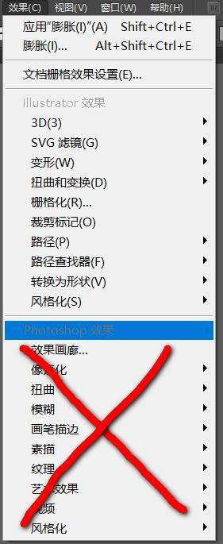

# 微信公众号交互 SVG 素材要求

[[toc]]

---

- ## 1.素材必须为矢量图，不能出现位图与矢量图混用的情况。尽量直接用 Adobe Illustrator 中的钢笔工具作图，最终提供的素材格式为.ai格式文件。
    - 储存时请储存为最大兼容性的版本
    - 如推文中涉及商业用途，请进行原创设计，或使用无版权素材
    - 尽量不要在 PS 中作图后再转曲线，会产生多余代码，导致卡顿
    - 请勿直接将位图转曲线，会导致代码冗杂
    - 高度不宜过长，画布宽度为640px时，总长度控制在15000px以内，画布宽度可自定义，不必局限于640px，上述640×15000仅供比例参考
    - 请勿使用 AI 中的“炭笔”、“粉笔”等细节较多的画笔类型，避免产生过多锚点。建议使用路径平滑的画笔
    
    
    - 填色时请勿使用渐变色，或带有渐变性质的阴影效果。微信中不支持渐变代码。如在 logo 或品牌 VI 中必须使用渐变色，可将元素栅格化后进行图像描摹处理。
    
    
    
    - 请勿使用Photoshop效果或风格化效果，此类效果无法以代码的形式输出 
    
    
    
    - 素材多余部分请直接进行裁切，请勿使用剪切蒙版，微信中抹去了剪切蒙版的对应代码
    - 保证各个元素编组明确，分层明确。

---
    
- ## 2.微信交互图文支持通篇使用非系统高清字体，如需保留非系统字体，所有文字必须轮廓化，但请勿轮廓化描边
    - 如推文中涉及商业用途，请使用已购买版权的字体
    - 请使用路径平滑的字体。避免使用细节太多的字体容易导致代码冗杂（例如毛笔字体）
    
    
    - 如通篇使用非系统高清字体，请预先提供已确认无误的文案，因为文字轮廓化后无法直接更改。

---

- ## 3.关于位图的说明
    - 能够使用位图的样式：
        - 找不同样式的背景图
        - 弹幕的背景图
        - 新年签的背景图
    - 使用位图作为背景图后，样式的交互性会受到一定限制，例如：
        - 用位图做背景图的新年签只能抽取一次
        - 用位图做转盘，只能指针转，无法转盘转动
        - 所有位图格式的内容均无法添加动画效果及交互效果
    - 因此，在非必要情况下，请尽量采用全矢量图的形式，避免素材中出现位图。