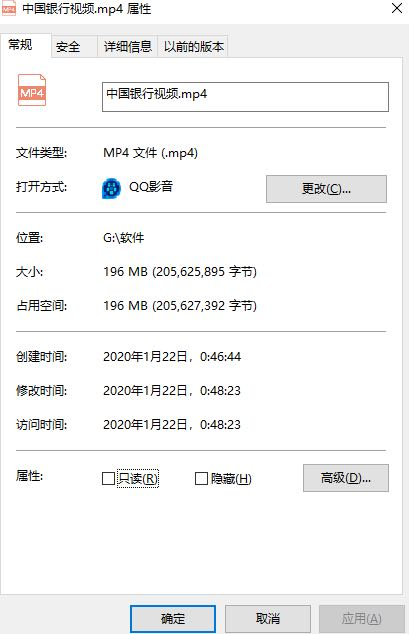
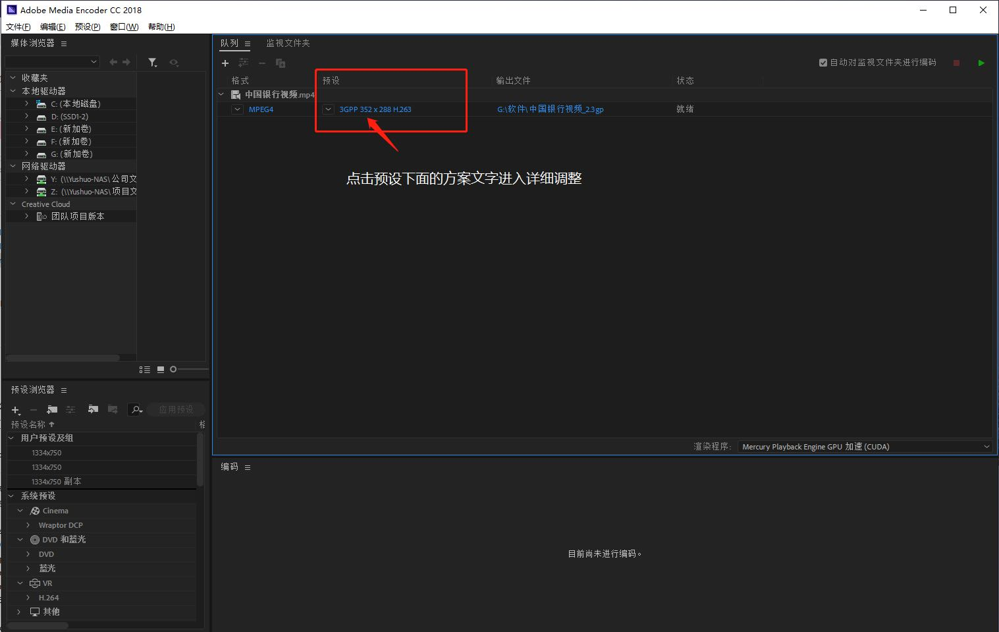
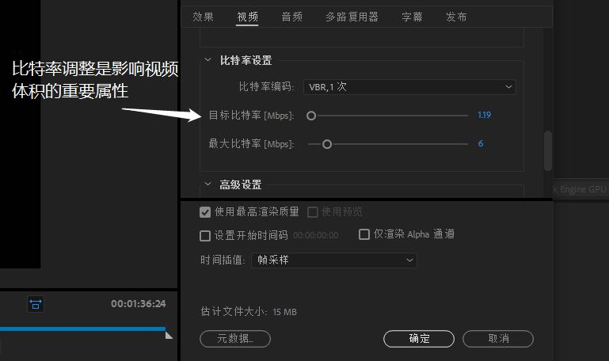
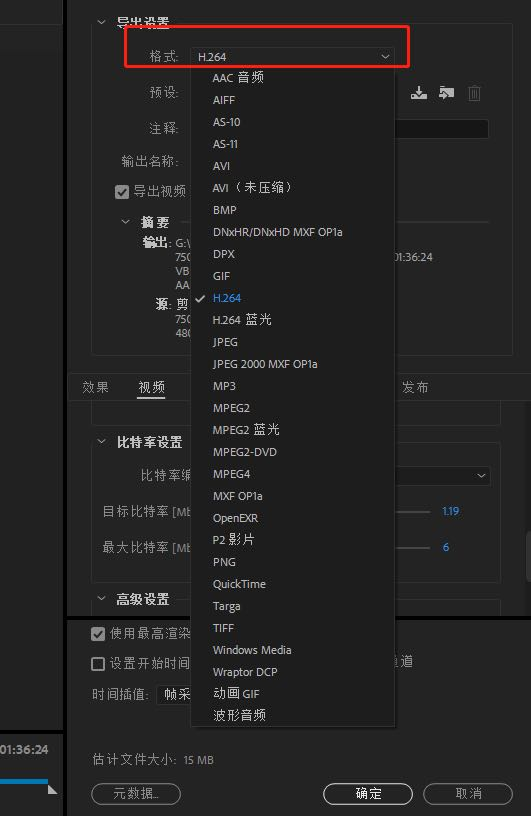
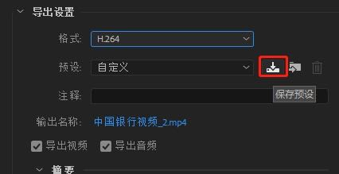
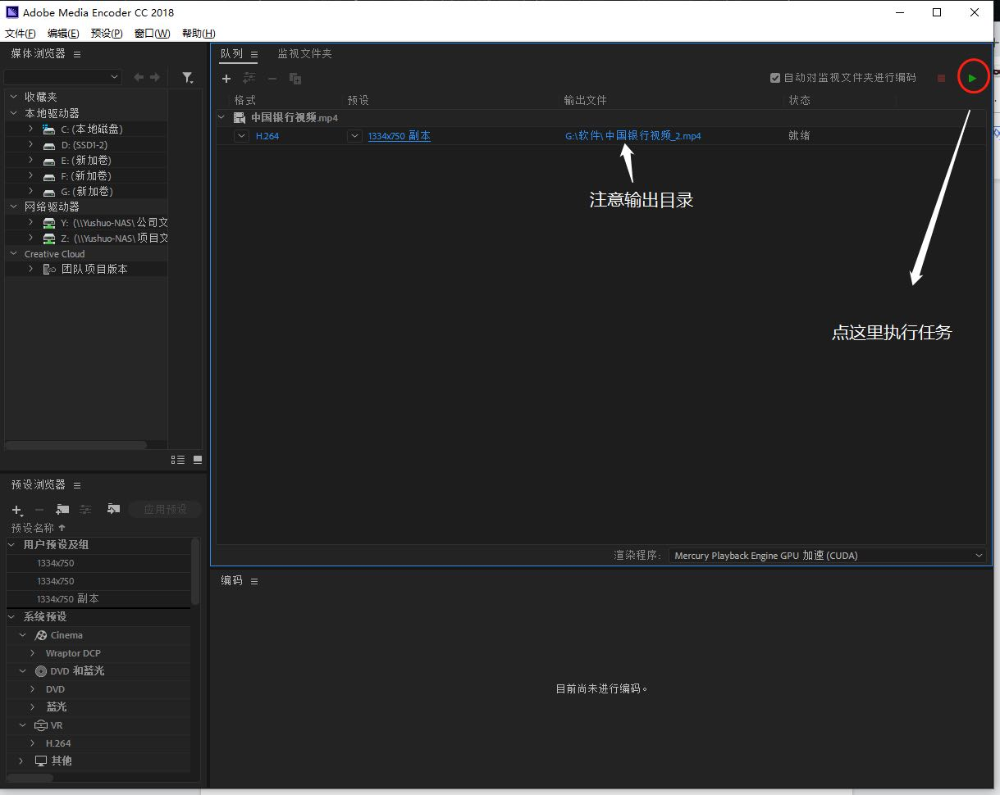
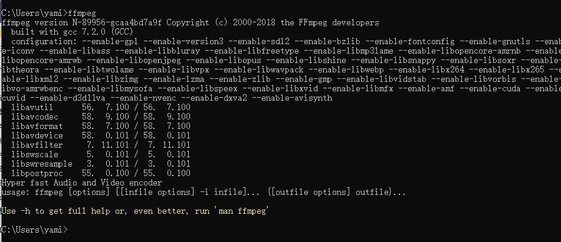
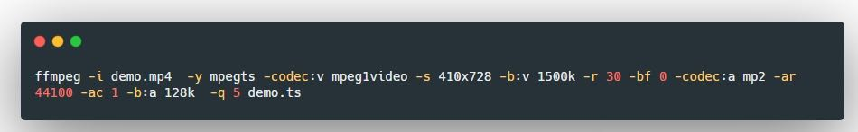

# 前端网页视频处理工具使用指南

### 目录：

[toc]

### 读者须知：

1. *本文仅涉及网站常用视频格式、尺寸、码率、压缩、TS转换技术进行讲解，部分图片缩小无法仔细查看可以点击放大查看。*

2. *本教程采用图文结合讲解模式，请仔细查看操作示意图与文字说明进行操作*

3. *本文档由Yami撰写*          

   ***

   

### 一 丶准备工作：   

#### 1. 需要处理的视频文件，格式一般是mp4、avi、mov等等   

#### 2. 音频处理软件：Adobe Media Encoder，NAS上有附带和谐版本下载

#### 3. FFMPEG 视频处理组件，免费开源，下载地址 <https://ffmpeg.zeranoe.com/builds/>   

***

   

### 二 丶 处理视频 :   

#### 1. 打开 Adobe Media Encoder，打开（或拖拽）要处理的视频，

（本文的演示视频是一个196M大小的视频文件，如下图）   

	  

 

#### 2. 在软件中打开视频后界面如下：

#### 3. 按上图点击这个视频的预设方案进行详细调整   

#### 4. 比特率是影响视频体积的重要属性  

    

#### 5.将视频导出为其他格式

+  在 Adobe Media Encoder中可以把视频导出GIF（认真的？）、序列帧等其他格式   

   

#### 6.完成以上操作时的需要注意的事项

+ 一般项目可能会反复调整视频，那意味客户每发一次视频来你都要重复上述操作，我们可以把上述的设置保存为一个预设、下次直接适用这个预设即可，不需要重复劳动了（何况也容易点错）。   

  

   

   

#### 7. 最后一步，设置完了后，应该执行设置

（若看不清图片请点击放大图片查看）

### 三  丶处理视频格式 (将视频格式转换为ts格式):

#### 1.确认已经安装好了 FFMPEG

+ 若出现上图信息 则表示安装成功（无报错信息）

  

#### 2.执行命令

#### 3.具体代码

`ffmpeg -i demo.mp4  -y mpegts -codec:v mpeg1video -s 410x728 -b:v 1500k -r 30 -bf 0 -codec:a mp2 -ar 44100 -ac 1 -b:a 128k  -q 5 demo.ts`   

#### 4.重要参数

+ -y  覆盖生成的文件（如果有同名的）

+ -i 指定输入文件名

+ -s 分辨率尺寸 宽x高

+ -r 帧率

+ -q 目标文件质量选项 5，可以在1~8之间调整

### 四丶附录：

+ 参考资料：FFmpeg 视频处理入门教程

+ <http://www.ruanyifeng.com/blog/2020/01/ffmpeg.html>

  

#### FFMPEG参数说明列表：

#### 1. 基本选项：

| 指令名              | 功能                                                         |
| :------------------ | :----------------------------------------------------------- |
| -formats            | 输出所有可用格式                                             |
| -i filename         | 指定输入文件名，在linux下当然也能指定:0.0(屏幕录制)或摄像头  |
| -y                  | 覆盖已有文件                                                 |
| -t duration         | 记录时长为t                                                  |
| -fs limit_size      | 设置文件大小上限                                             |
| -ss time_off        | 从指定的时间(s)开始， [-]hh🇲🇲ss[.xxx]的格式也支持            |
| -itsoffset time_off | 设置时间偏移(s)，该选项影响所有后面的输入文件。该偏移被加到输入文件的时戳，定义一个正偏移意味着相应的流被延迟了 offset秒。 [-]hh🇲🇲ss[.xxx]的格式也支持 |
| -title string       | 标题                                                         |
| -timestamp time     | 时间戳                                                       |
| -author string      | 作者                                                         |
| -copyright string   | 版权信息                                                     |
| -comment string     | 评论                                                         |
| -album string       | album名                                                      |
| -v verbose          | 与log相关的                                                  |
| -target type        | 设置目标文件类型("vcd", "svcd", "dvd", "dv", "dv50", "pal-vcd", "ntsc-svcd", ...) |
| -dframes number     | 设置要记录的帧数                                             |

   

#### 2. 视频选项

| 选项名            | 功能                                                         |
| ----------------- | ------------------------------------------------------------ |
| -b                | 指定比特率(bits/s)，似乎ffmpeg是自动VBR的，指定了就大概是平均比特率 |
| -vb               | 指定视频比特率(bits/s)                                       |
| -vframes number   | 设置转换多少桢(frame)的视频                                  |
| -r rate           | 桢速率(fps)                                                  |
| -s size           | 分辨率                                                       |
| -aspect aspect    | 设置视频长宽比(4:3, 16:9 or 1.3333, 1.7777)                  |
| -croptop size     | 设置顶部切除尺寸(in pixels)                                  |
| -cropbottom size  | 设置底部切除尺寸(in pixels)                                  |
| -cropleft size    | 设置左切除尺寸 (in pixels)                                   |
| -cropright size   | 设置右切除尺寸 (in pixels)                                   |
| -padtop size      | 设置顶部补齐尺寸(in pixels)                                  |
| -padbottom size   | 底补齐(in pixels)                                            |
| -padleft size     | 左补齐(in pixels)                                            |
| -padright size    | 右补齐(in pixels)                                            |
| -padcolor color   | 补齐带颜色(000000-FFFFFF)                                    |
| -vn               | 取消视频                                                     |
| -vcodec codec     | 强制使用codec编解码方式('copy' to copy stream)               |
| -sameq            | 使用同样视频质量作为源（VBR）                                |
| -pass n           | 选择处理遍数（1或者2）。两遍编码非常有用。第一遍生成统计信息，第二遍生成精确的请求的码率 |
| -passlogfile file | 选择两遍的纪录文件名为file                                   |
| -newvideo         | 在现在的视频流后面加入新的视频流##### 3. 高级视频选项        |

#### 3. 高级视频选项

| 选项名          | 功能                                                         |
| --------------- | ------------------------------------------------------------ |
| -pix_fmt format | set pixel format, 'list' as argument shows all the pixel formats supported |
| -intra          | 仅适用帧内编码                                               |
| -qscale q       | 以<数值>质量为基础的VBR，取值0.01-255，约小质量越好          |
| -loop_input     | 设置输入流的循环数(目前只对图像有效)                         |
| -loop_output    | 设置输出视频的循环数，比如输出gif时设为0表示无限循环         |
| -g int          | 设置图像组大小                                               |
| -cutoff int     | 设置截止频率                                                 |
| -qmin int       | 设定最小质量                                                 |
| -qmax int       | 设定最大质量                                                 |
| -qdiff int      | 量化标度间最大偏差 (VBR)                                     |
| -bf int         | 使用frames B 帧，支持mpeg1,mpeg2,mpeg4                       |

#### 4. 音频选项

| 选项名          | 功能                                    |
| --------------- | --------------------------------------- |
| -ab             | 设置比特率(单位：bit/s，也许老版是kb/s) |
| -aframes number | 设置转换多少桢(frame)的音频             |
| -aq quality     | 设置音频质量 (指定编码)                 |
| -ar rate        | 设置音频采样率 (单位：Hz)               |
| -ac channels    | 设置声道数                              |
| -an             | 取消音频                                |
| -acodec codec   | 指定音频编码('copy' to copy stream)     |
| -vol volume     | 设置录制音量大小(默认为256)             |
| -newaudio       | 在现在的音频流后面加入新的音频流        |

   

#### 5. 字幕选项

| 选项名          | 功能                                |
| --------------- | ----------------------------------- |
| -sn             | 取消字幕                            |
| -scodec codec   | 设置字幕编码('copy' to copy stream) |
| -newsubtitle    | 在当前字幕后新增                    |
| -slang code     | 设置字幕所用的ISO 639编码(3个字母)  |
| Audio/Video     | 抓取选项:                           |
| -vc channel     | 设置视频捕获通道(只对DV1394)        |
| -tvstd standard | 设置电视标准 NTSC PAL(SECAM)        |

