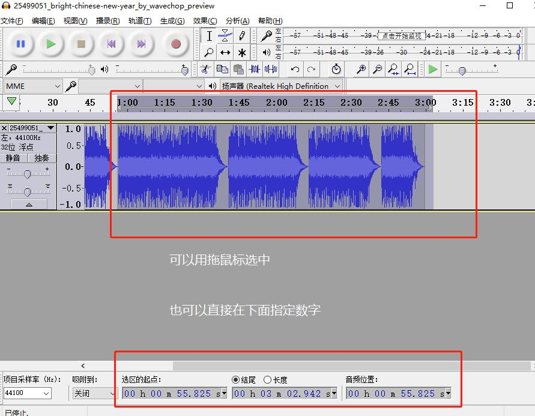
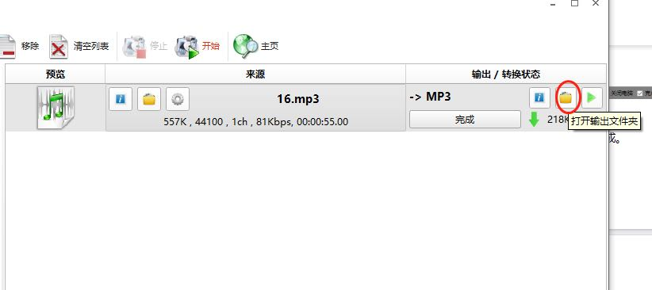

# 前端开发音频压缩工具使用指南  

### 目录：

[TOC]

***

### 请注意:

#####  1.*本文适用前端常见音频格式，不适用与对声音要求较高的项目，如音乐类、射击游戏类。*

##### 2. *本文只涉及到音频压缩方向操作，并不包含混响、音轨合并等，有兴趣继续可自行深入研究*

##### 3.*本教程采用图文结合讲解模式，请仔细查看操作示意图与文字说明进行操作*

##### 4. *本文档由Yami撰写*   

***

### 一丶 准备工具      

##### 1.需要处理的音频文件，格式一般是mp3、ogg、wav等.   

##### 2. 音频处理软件：Audacity，免费开源软件，官网以及下载地址: <https://www.audacityteam.org/>   

##### 3. 音频压缩软件：格式工厂，免费软件，官方以及下载地址：  

<http://www.pcfreetime.com/formatfactory/CN/index.html>   

------------------------------

### 二丶处理音频  

##### 1. 打开 Audacity 

 

***

##### 2.选择菜单:文件->打开 或 直接拖拽音频到软件界面   

  

***

##### 3.分离左右声道   (注：如果音频本身就是单声道就忽略以下步骤)

#####      

***

##### 4.分离过后左右声道均会独立      

  

***

##### 5.删除左或右其中一个声道   

   

***

##### 6. 把剩下的左或右转成单声道    

   

这样就可以大大的缩小音频的体积	 

  

-----

​    

### 三 丶其他操作  (剪辑音频，去掉不需要的部分音频) 

##### 1.选择要删除的音频，然后删除

​        

***

##### 2. 处理剪辑后的音频   

 通常剪辑过后的音频需要处理一下，例如淡入淡出，同样选择头部或尾部，选择菜单中的：效果 -> 淡入   

  

此外，还可以改变音频文件的音量大小、播放速度等等，大家可以自行研究。

一切完成后，选择菜单：文件 -> 导出 mp3 即可。    

-------

### 四 丶 压缩音频      

 *事实上压缩音频工具有很多，但是都基本上差不多，本文以格式工厂音频压缩步骤举例*   

   

##### 1. 打开格式工厂软件后，点击左侧菜单：音频 -> MP3   

 

   

***

##### 2. 添加或拖拽文件到对话框中   

    

   

***

##### 3. 在输出配置中选择“低质量”   

    

选择完成后，点击确定按钮（依次点击两次确定）返回到主界面。     

***

返回主界面后在任务列表中能查看到刚刚添加的MP3转换任务

(这里MP3转MP3没毛病，我们目的是压缩音频）。  

 

##### 4.确认无误后点击上图中红框圈出来的“开始”，即可开始执行任务。至此，任务完成。

***

### &#10003;小提示：

#### 在添加文件的时候就可以指定文件输出目录，如果忘记设置了，也可以在完成的任务找到输出目录，如下图。   

 

​     

  

